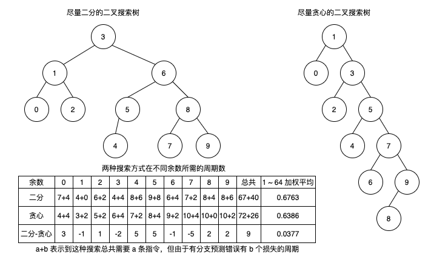

## 简介

Architecture Lab 属于《深入理解计算机》第四章和第五章。这 Lab 第一部分和第二部分仅需要第四章——处理器体系结构的知识，主要用于练习汇编指令和控制逻辑设计；第三部分需要第五章——优化程序性能的知识，主要通过循环展开等技术进一步提高程序的 CPE 。

## 准备

可以在 [官网](http://csapp.cs.cmu.edu/3e/labs.html) 下载 Architecture Lab 相关的程序。

开始前需要阅读 [Architecture Lab writeup](http://csapp.cs.cmu.edu/3e/archlab.pdf)  （刚刚下载的压缩包内也有），可以知道本次 Lab 由 3 部分组成。

本次需要使用的程序依旧需要在 Docker 中运行，将本地 Lab 的目录挂载进容器中即可：

```shell script
docker run -ti -v {PWD}:/csapp ubuntu:18.04
```

进入容器后需要安装一些必须软件以便后续能成功运行：

```shell script
apt-get update && apt-get -y install gcc make flex bison libgetopt-complete-perl
```

由于我们不使用 GUI 模式且没有安装相关依赖，所以需要注释掉 `sim/Makefile` 文件中的 `GUIMODE`, `TKLIBS`, `TKINC` 这三行，然后在 `sim` 文件夹下运行 `make clean && make` 生成本次所需的程序。

然后就可以愉快的开始闯关了。

## 闯关

### 第一部分

第一部分主要是写 3 个简单的 `Y86-64` 程序，并且熟悉相关的工具，本部分所有操作均在 `sim/misc` 文件夹内进行。这三个程序都是使用 `Y86-64` 指令集的汇编程序，与常用的汇编语言无太大差别，看完本章就开始做不需要额外的参考资料。

#### 循环求链表和

第一个程序 `sum.ys` 需要实现一个函数 `sum_list` 使用循环对一个链表求和，对应的 C 语言代码如下：

```c
/* linked list element */
typedef struct ELE {
    long val;
    struct ELE *next;
} *list_ptr;

/* sum_list - Sum the elements of a linked list */
long sum_list(list_ptr ls)
{
    long val = 0;
    while (ls) {
        val += ls->val;
        ls = ls->next;
    }
    return val;
}
```

刚开始还不知道怎么写，发现 `sim/y86-code/asum.ys` 内包含完整的程序，就直接复制一份开始改写即可：
- 将全局变量替换为我们的 3 节点链表
- 将 `sum` 函数替换为我们的需要实现的链表求和逻辑 `sum_list`
- 将 `main` 函数中的逻辑改为执行 `sum_list(ele1)` 的逻辑

改写完的代码如下：

```assemble
# Execution begins at address 0 
    .pos 0
    irmovq stack, %rsp  # Set up stack pointer
    call main           # Execute main program
    halt                # Terminate program 

# Sample linked list
    .align 8
ele1:
    .quad 0x00a
    .quad ele2
ele2:
    .quad 0x0b0
    .quad ele3
ele3:
    .quad 0xc00
    .quad 0

main:
    irmovq ele1,%rdi
    call sum_list     # sum_list(ele1)
    ret

# long sum_list(list_ptr ls)
# ls in %rdi
sum_list:
    irmovq $8,%r8        # Constant 8
    xorq %rax,%rax       # sum = 0
    andq %rdi,%rdi       # Set CC
    jmp     test         # Goto test
loop:
    mrmovq (%rdi),%r9    # Get ls -> val
    addq %r9,%rax        # Add to sum
    mrmovq 8(%rdi),%rdi  # ls = ls -> next
    andq %rdi,%rdi       # Set CC
test:
    jne    loop          # Stop when 0
    ret                  # Return

# Stack starts here and grows to lower addresses
    .pos 0x200
stack:
```

然后可以测试我们的程序：

```shell script
> ./yas sum.ys && ./yis sum.yo
Stopped in 27 steps at PC = 0x13.  Status 'HLT', CC Z=1 S=0 O=0
Changes to registers:
%rax:	0x0000  0x0cba
%rsp:	0x0000  0x0200
%r8:	0x0000  0x0008
%r9:	0x0000  0x0c00

Changes to memory:
0x01f0:	0x0000  0x005b
0x01f8:	0x0000  0x0013
```

可以发现程序运行完的状态没有问题，寄存器 `%rax` 中的值为 `0xcba` ，与实际求和结果相符，表明我们程序没有问题。内存更改有两处，都是栈中的值，分别是调用 `main` 和 `sum_list` 的指令的下一条指令，用于函数内部返回用。

#### 递归求链表和

第二个程序 `rsum.ys` 需要实现一个函数 `rsum_list` 使用递归对一个链表求和，对应的 C 语言代码如下：

```c
/* rsum_list - Recursive version of sum_list */
long rsum_list(list_ptr ls)
{
    if (!ls) {
        return 0;
    } else {
        long val = ls->val;
        long rest = rsum_list(ls->next);
        return val + rest;
    }
}
```

我们直接复制 `sum.ys` 为 `rsum.ys` ，然后将 `sum_list` 的更改为递归求和逻辑即可：

```assemble
...
main:
    irmovq ele1,%rdi
    call rsum_list       # rsum_list(ele1)
    ret

# long rsum_list(list_ptr ls)
# ls in %rdi
rsum_list:
    xorq %rax,%rax       # sum = 0
    andq %rdi,%rdi       # Set CC
    je     return        # Goto return
    pushq  %rbx          # Save callee-saved register
    mrmovq (%rdi),%rbx   # Get ls -> val
    mrmovq 8(%rdi),%rdi  # Set arg
    call rsum_list       # rsum_list(ls -> next)
    addq %rbx,%rax       # Add to sum
    popq %rbx            # Restore callee-saved register
return:
    ret                  # Return
...
```

然后可以测试我们的程序：

```shell script
> ./yas rsum.ys && ./yis rsum.yo
Stopped in 40 steps at PC = 0x13.  Status 'HLT', CC Z=0 S=0 O=0
Changes to registers:
%rax:	0x0000  0x0cba
%rsp:	0x0000  0x0200

Changes to memory:
0x01c0:	0x0000  0x0088
0x01c8:	0x0000  0x00b0
0x01d0:	0x0000  0x0088
0x01d8:	0x0000  0x000a
0x01e0:	0x0000  0x0088
0x01f0:	0x0000  0x005b
0x01f8:	0x0000  0x0013
```

可以发现程序运行完的状态没有问题，寄存器 `%rax` 中的值为 `0xcba` ，与实际求和结果相符，表明我们程序没有问题。内存更改有七处，都是栈中的值，其中五处用于保存调用指令的返回地址，两处 (`0x01c8`, `0x01d8`) 用于保存被调用者保存寄存器。

#### 拷贝数组

第三个程序 `copy.ys` 需要实现一个函数 `copy_block` 使用循环，将 `src` 中的 `len` 个数复制到 `dest` 中，并返回这些数的异或和，对应的 C 语言代码如下：

```c
/* copy_block - Copy src to dest and return xor checksum of src */
long copy_block(long *src, long *dest, long len)
{
    long result = 0;
    while (len > 0) {
        long val = *src++;
        *dest++ = val;
        result ^= val;
        len--;
    }
    return result;
}
```

我们直接复制 `rsum.ys` 为 `copy.ys` ，然后做如下修改即可：

- 将全局变量替换为长度为 3 的 `long` 数组
- 将 `rsum_list` 函数替换为我们的需要实现的拷贝函数 `copy_block`
- 将 `main` 函数中的逻辑改为执行 `copy_block(src, dest, 3)` 的逻辑

```assemble
...
    .align 8
# Source block
src:
    .quad 0x00a
    .quad 0x0b0
    .quad 0xc00
# Destination block
dest:
    .quad 0x111
    .quad 0x222
    .quad 0x333

main:
    irmovq src,%rdi
    irmovq dest,%rsi
    irmovq $3,%rdx
    call copy_block       # copy_block(src, desc, 3)
    ret

# long copy_block(long *src, long *dest, long len)
# src in %rdi, dest in %rsi, len in rdx
copy_block:
    irmovq $8,%r8        # Constant 8
    irmovq $1,%r9        # Constant 1
    xorq %rax,%rax       # result = 0
    jmp test             # Goto test
loop:
    mrmovq (%rdi),%r10   # Get *src
    xorq %r10,%rax       # result ^= *src
    rmmovq %r10,(%rsi)   # *dest = *src
    addq %r8,%rdi        # src++
    addq %r8,%rsi        # dest++
    subq %r9,%rdx        # len--
test:
    andq %rdx,%rdx       # Set CC （把 test 写在最后可以在循环中减少一次 jmq 跳转）
    jne loop             # Go to loop
    ret                  # Return
...
```

然后可以测试我们的程序：

```shell script
> ./yas copy.ys && ./yis copy.yo
Stopped in 39 steps at PC = 0x13.  Status 'HLT', CC Z=1 S=0 O=0
Changes to registers:
%rax:	0x0000  0x0cba
%rsp:	0x0000  0x0200
%rsi:	0x0000  0x0048
%rdi:	0x0000  0x0030
%r8:	0x0000  0x0008
%r9:	0x0000  0x0001
%r10:	0x0000  0x0c00

Changes to memory:
0x0030:	0x0111  0x000a
0x0038:	0x0222  0x00b0
0x0040:	0x0333  0x0c00
0x01f0:	0x0000  0x006f
0x01f8:	0x0000  0x0013
```

可以发现程序运行完的状态没有问题，寄存器 `%rax` 中的值为 `0xcba` ，与实际异或和结果相符，且 `dest` 中的值已经改为 `src` 中对应的值，表明我们程序没有问题。其余的内存更改还有两处，都是栈中的值，分别是调用 `main` 和 `copy_block` 的指令的下一条指令，用于函数内部返回用。

### 第二部分

第二部分主要是改写 `sim/seq/seq-full.hcl` 文件，使得已有的 `SEQ` 处理器支持 `iaddq` 这条指令（对应家庭作业 `4.51`, `4.52` (`P328`)），本部分所有操作均在 `sim/seq` 文件夹内进行。

#### `iaddq` 的不同阶段处理


首先就是需要参照图 4-18 根据 `addq` 指令列出 `iaddq` 指令的不同阶段处理情况。

| 阶段 | `iaddq V, rB` |
| --- | --- |
| 取指 | icode:ifun ← M1[PC] <br/> rA:rB ← M1[PC + 1] <br/> valC ← M8[PC + 2] <br/> valP ← PC + 10|
| 译码 | valB ← R[rB] |
| 执行 | valE ← valB + valC <br/> Set CC|
| 访存 | |
| 写回 | R[rB] ← valE |
| 更新 PC | PC ← valP |

其中 `icode = 0xc`, `ifun = 0`, `rA = 0xf` 。

#### 修改控制逻辑

有了每个阶段需要处理的事情之后，我们就需要修改控制逻辑，使得原本的 `SEQ` 处理器能处理我们新增的 `iaddq` 指令。

我们观察 `addq` 和 `iaddq` 及电路的控制逻辑可以发现，有以下 8 处需要特殊处理：
1. 修改 `instr_valid` 判断逻辑，识别出 `iaddq` 指令合法

    ```hcl
    bool instr_valid = icode in 
        { INOP, IHALT, IRRMOVQ, IIRMOVQ, IRMMOVQ, IMRMOVQ,
            IOPQ, IJXX, ICALL, IRET, IPUSHQ, IPOPQ, IIADDQ }; 
    ```
2. 修改 `need_regids` 的判断逻辑，识别出 `iaddq` 指令需要从指令中读出寄存器 ID ：

    ```hcl
    # Does fetched instruction require a regid byte?
    bool need_regids =
        icode in { IRRMOVQ, IOPQ, IPUSHQ, IPOPQ, 
            IIRMOVQ, IRMMOVQ, IMRMOVQ, IIADDQ };
    ```
3. 修改 `need_valC` 的判断逻辑，识别出 `iaddq` 指令需要从指令中读出一个常数：

    ```hcl
    # Does fetched instruction require a constant word?
    bool need_valC =
        icode in { IIRMOVQ, IRMMOVQ, IMRMOVQ, IJXX, ICALL, IIADDQ };
    ```
4. 修改 `srcB` 的选择逻辑，选择 `valB` 的源寄存器地址 `srcB` 为 `rB` ：

    ```hcl
    ## What register should be used as the B source?
    word srcB = [
        # iaddq 指令选择 rB 为 srcB
        icode in { IOPQ, IRMMOVQ, IMRMOVQ, IIADDQ  } : rB;
        icode in { IPUSHQ, IPOPQ, ICALL, IRET } : RRSP;
        1 : RNONE;  # Don't need register
    ];
    ```
5. 修改 `dstE` 的选择逻辑，选择 `valE` 的目的寄存器地址 `dstE` 为 `rB` ：

    ```hcl
    ## What register should be used as the E destination?
    word dstE = [
        icode in { IRRMOVQ } && Cnd : rB;
        # iaddq 指令选择 rB 为 dstE
        icode in { IIRMOVQ, IOPQ, IIADDQ} : rB;
        icode in { IPUSHQ, IPOPQ, ICALL, IRET } : RRSP;
        1 : RNONE;  # Don't write any register
    ];
    ```
6. 修改 `aluA` 的选择逻辑，选择传给 ALU 的 `aluA` 为指令的立即数 `valC` ：

    ```hcl
    ## Select input A to ALU
    word aluA = [
        # 最开始先特殊处理 iaddq 的指令，让其选择 valC
        icode == IIADDQ: valC;
        icode in { IRRMOVQ, IOPQ } : valA;
        icode in { IIRMOVQ, IRMMOVQ, IMRMOVQ } : valC;
        icode in { ICALL, IPUSHQ } : -8;
        icode in { IRET, IPOPQ } : 8;
        # Other instructions don't need ALU
    ];
    ```
7. 修改 `aluB` 的选择逻辑，选择传给 ALU 的 `aluB` 为寄存器 `rB` 的值 `valB`

    ```hcl
    ## Select input B to ALU
    word aluB = [
        icode in { IRMMOVQ, IMRMOVQ, IOPQ, ICALL, 
                  IPUSHQ, IRET, IPOPQ, IIADDQ } : valB;
        icode in { IRRMOVQ, IIRMOVQ } : 0;
        # Other instructions don't need ALU
    ];
    ```
8. 修改 `set_cc` 逻辑，识别出 `iaddq` 指令同样需要设置条件码寄存器：

    ```hcl
    ## Should the condition codes be updated?
    # iaddq 指令也需要更新条件码寄存器
    bool set_cc = icode in { IOPQ, IIADDQ };
    ```

修改完毕后，我们首先使用一个简单的程序自测一下，如果有问题就需要根据错误提示继续修改，没有问题就可以执行完整的测试了：

```shell script
> make VERSION=full && ./ssim -t ../y86-code/asumi.yo
# Building the seq-full.hcl version of SEQ
../misc/hcl2c -n seq-full.hcl <seq-full.hcl >seq-full.c
gcc -Wall -O2  -I../misc  -o ssim \
	seq-full.c ssim.c ../misc/isa.c  -lm
Y86-64 Processor: seq-full.hcl
137 bytes of code read
...
32 instructions executed
Status = HLT
Condition Codes: Z=1 S=0 O=0
Changed Register State:
%rax:	0x0000000000000000	0x0000abcdabcdabcd
%rsp:	0x0000000000000000	0x0000000000000100
%rdi:	0x0000000000000000	0x0000000000000038
%r10:	0x0000000000000000	0x0000a000a000a000
Changed Memory State:
0x00f0:	0x0000000000000000	0x0000000000000055
0x00f8:	0x0000000000000000	0x0000000000000013
ISA Check Succeeds
```

可以发现我们的修改逻辑能通过一个简单的测试，现在需要运行完整的测试逻辑了：

```shell script
# 测试结果正确性
> cd ../y86-code; make testssim
...
asum.seq:ISA Check Succeeds
asumr.seq:ISA Check Succeeds
cjr.seq:ISA Check Succeeds
j-cc.seq:ISA Check Succeeds
poptest.seq:ISA Check Succeeds
prog1.seq:ISA Check Succeeds
prog2.seq:ISA Check Succeeds
prog3.seq:ISA Check Succeeds
prog4.seq:ISA Check Succeeds
prog5.seq:ISA Check Succeeds
prog6.seq:ISA Check Succeeds
prog7.seq:ISA Check Succeeds
prog8.seq:ISA Check Succeeds
pushquestion.seq:ISA Check Succeeds
pushtest.seq:ISA Check Succeeds
ret-hazard.seq:ISA Check Succeeds
...

# 测试 iaddq 执行前后的所有状态的正确性
> cd ../ptest; make SIM=../seq/ssim TFLAGS=-i
./optest.pl -s ../seq/ssim -i
Simulating with ../seq/ssim
  All 58 ISA Checks Succeed
./jtest.pl -s ../seq/ssim -i
Simulating with ../seq/ssim
  All 96 ISA Checks Succeed
./ctest.pl -s ../seq/ssim -i
Simulating with ../seq/ssim
  All 22 ISA Checks Succeed
./htest.pl -s ../seq/ssim -i
Simulating with ../seq/ssim
  All 756 ISA Checks Succeed
```

通过所有测试用例，表明我们的修改正确有效。这一部分涵盖了设计一条指令的完整流程，先分析一条新指令的各个阶段的操作，然后再分析出每个操作设计的控制逻辑，再对相应的控制逻辑进行修改，最后使得原有的指令集能支持一条全新的指令。如果仅仅读书自学，还是很容易懵；结合实践就感觉很简单，也加深了对各种操作和控制逻辑的关联的理解。

### 第三部分

第三部分主要是改写 `sim/pipe/ncopy.ys`和 `sim/pipe/pipe-full.hcl` 文件，使得已有的 `PIPE` 处理器运行 `ncopy.ys` 时尽可能快，本部分所有操作均在 `sim/seq` 文件夹内进行。其中函数 `ncopy` 的功能是拷贝数组元素，并返回其中整数的个数。。

第三部分具体要求如下：

- 正确修改 `ncopy.ys` 和 `pipe-full.hcl` 文件，通过所有测试用例
- 假设程序可以在 C 个周期内拷贝 N 个元素，那么定义 `CPE = C / N` ，目标是使这个值尽可能小，初始程序 `CPE = 897/63 = 14.24` ，当 `CPE < 7.50` 时可取得满分（已知最小的 `CPE` 为 `7.48`），通常情况应该让 `CPE < 9.00`

#### 分析优化点

在知识点回顾部分中，已经了解过这里可以如何优化了：

- 需要将条件转移指令修改为条件传送指令，避免分支预测这个过程，从而避免分支预测错误导致取消指令
- 优化 `ncopy.ys` 代码，尽可能减少需要执行的指令
    - 循环内最后再执行 `subq %r8, %rdx` ，可以减少循环内的 1 条指令 `andq %rdx,%rdx`
    - 在循环外设置需要的常量，可以减少循环内的 2 条指令 `irmovq $1, %r10`, `irmovq $8, %r10`
    - 使用 `iaddq` 指令，可以减少循环外的 1 条常量设置的指令
    - 将 `mrmovq` 和 `rmmovq` 指令分开，可以减少因为加载/使用冒险而产生的一个周期暂停（也可以修改控制逻辑，使这种情况不需要暂停，控制逻辑的修改对应家庭作业 `4.57` (`P329`)）

#### 支持 `iaddq` 指令

首先就是需要实现 `iaddq` 指令的流水线控制逻辑，我们根据第二部分中的分析结果及流水线的控制逻辑可知需要修改以下 8 处相应的控制逻辑（可对照书中 `P302` 图 4-52 进行修改）：


1. 修改 `instr_valid` 判断逻辑，识别出 `iaddq` 指令合法

    ```hcl
    # Is instruction valid?
    bool instr_valid = f_icode in 
        { INOP, IHALT, IRRMOVQ, IIRMOVQ, IRMMOVQ, IMRMOVQ,
          IOPQ, IJXX, ICALL, IRET, IPUSHQ, IPOPQ, IIADDQ };
    ```
2. 修改 `need_regids` 的判断逻辑，识别出 `iaddq` 指令需要从指令中读出寄存器 ID ：

    ```hcl
    # Does fetched instruction require a regid byte?
    bool need_regids =
        f_icode in { IRRMOVQ, IOPQ, IPUSHQ, IPOPQ, 
                 IIRMOVQ, IRMMOVQ, IMRMOVQ, IIADDQ };
    ```
3. 修改 `need_valC` 的判断逻辑，识别出 `iaddq` 指令需要从指令中读出一个常数：

    ```hcl
    # Does fetched instruction require a constant word?
    bool need_valC =
        f_icode in { IIRMOVQ, IRMMOVQ, IMRMOVQ, IJXX, ICALL, IIADDQ };
    ```
4. 修改 `d_srcB` 的选择逻辑，选择 `d_rvalB` 的源寄存器地址 `d_srcB` 为 `D_rB` ：

    ```hcl
    ## What register should be used as the B source?
    word d_srcB = [
        # iaddq 指令需要读寄存器 rB
        D_icode in { IOPQ, IRMMOVQ, IMRMOVQ, IIADDQ } : D_rB;
        D_icode in { IPUSHQ, IPOPQ, ICALL, IRET } : RRSP;
        1 : RNONE;  # Don't need register
    ];
    ```
5. 修改 `d_dstE` 的选择逻辑，选择 `d_valE` 的目的寄存器地址 `d_dstE` 为 `D_rB` ：

    ```hcl
    ## What register should be used as the E destination?
    word d_dstE = [
        # iaddq 指令需要写寄存器 rB
        D_icode in { IRRMOVQ, IIRMOVQ, IOPQ, IIADDQ } : D_rB;
        D_icode in { IPUSHQ, IPOPQ, ICALL, IRET } : RRSP;
        1 : RNONE;  # Don't write any register
    ];
    ```
6. 修改 `aluA` 的选择逻辑，选择传给 ALU 的 `aluA` 为指令的立即数 `E_valC` ：

    ```hcl
    ## Select input A to ALU
    word aluA = [
        # iaddq 指令的操作数 A 来自指令中的立即数
        E_icode == IIADDQ : E_valC;
        E_icode in { IRRMOVQ, IOPQ } : E_valA;
        E_icode in { IIRMOVQ, IRMMOVQ, IMRMOVQ } : E_valC;
        E_icode in { ICALL, IPUSHQ } : -8;
        E_icode in { IRET, IPOPQ } : 8;
        # Other instructions don't need ALU
    ];
    ```
7. 修改 `aluB` 的选择逻辑，选择传给 ALU 的 `aluB` 为寄存器 `rB` 的值 `E_valB`

    ```hcl
    ## Select input B to ALU
    word aluB = [
        E_icode in { IRMMOVQ, IMRMOVQ, IOPQ, ICALL, 
                 IPUSHQ, IRET, IPOPQ, IIADDQ } : E_valB;
        E_icode in { IRRMOVQ, IIRMOVQ } : 0;
        # Other instructions don't need ALU
    ];
    ```
8. 修改 `set_cc` 逻辑，识别出 `iaddq` 指令同样需要设置条件码寄存器：

    ```hcl
    ## Should the condition codes be updated?
    bool set_cc = E_icode in { IOPQ, IIADDQ } &&
        # State changes only during normal operation
        !m_stat in { SADR, SINS, SHLT } && !W_stat in { SADR, SINS, SHLT };
    ```

修改完成后，我们需要先验证其是否正确：

```shell script
# 重新构建模拟器
> make psim VERSION=full

# 测试小用例
> ./psim -t sdriver.yo
Y86-64 Processor: pipe-full.hcl
349 bytes of code read
...
65 instructions executed
Status = HLT
...
ISA Check Succeeds
CPI: 61 cycles/52 instructions = 1.17
```

发现两个基本用例都通过了，表明我们的 `iaddq` 指令的控制逻辑没有问题，接下来就需要修改函数 `ncopy` 了，使其尽可能快。 

#### 优化函数 `ncopy`

根据前面分析的那样，函数 `ncopy` 有 4 处地方可以优化，按照相应的分析结果进行优化，可得一下代码：

```assemble
##################################################################
# Do not modify this portion
# Function prologue.
# %rdi = src, %rsi = dst, %rdx = len
ncopy:

##################################################################
# You can modify this portion
    # Loop header
    xorq %rax,%rax      # count = 0;
    irmovq $1, %r8
    andq %rdx,%rdx		# len > 0?
    jmp Test            # Goto Test:

Loop:
    mrmovq (%rdi), %r10 # read val from src...
    xorq %r9, %r9       # diff = 0
    # 将 rmmovq 与 mrmovq 分开，减少因为加载/使用冒险而产生的一个周期暂停
    # （也可以修改控制逻辑，使这种情况不需要暂停，控制逻辑的修改对应家庭作业 `4.57` (`P329`)）
    rmmovq %r10, (%rsi) # ...and store it to dst
    andq %r10, %r10     # val > 0?
    cmovg %r8, %r9      # if so, diff = 1
    addq %r9, %rax		# count += diff
    iaddq $8, %rdi		# src++
    iaddq $8, %rsi		# dst++
    iaddq $-1, %rdx		# len--
Test:
    jg Loop             # if so, goto Loop:
##################################################################
# Do not modify the following section of code
# Function epilogue.
Done:
	ret
##################################################################
```

然后运行测试程序：

```shell script
# 验证正确性
> ./correctness.pl -p
...
68/68 pass correctness test

# 验证性能
> ./benchmark.pl
...
Average CPE	11.26
Score	0.0/60.0
```

一顿操作猛如虎，一看得分 0.0 ，有点震惊🤯，这怎么能忍，还得继续分析优化。

#### 尝试再次优化函数 `ncopy`

我们回看刚刚优化的程序：其中循环部分有 5 条指令必不可少（`mrmovq (%rdi), %r10`, `rmmovq %r10, (%rsi)`, `iaddq $8, %rdi`, `iaddq $8, %rsi`, `iaddq $-1, %rdx`），而剩余的 4 条指令就是为了使用条件传送给 `%rax` 加上 `0/1` ，这一个简单操作占用了 4 条指令太不应该了，那么就需要把这块优化掉。

先看看给 `%rax` 加上 `0/1` 为什么要使用 4 条指令：
- 先将一个寄存器 `%r9` 设置为 `0`
- 再对寄存器 `%r10` 执行 `andq` 用于设置条件码寄存器
- 然后执行条件传送，当寄存器 `%r10` 内的数大于 `0` 时，将寄存器 `%r9` 设置为 `0`
- 最后再将寄存器 `%r9` 的值加到寄存器 `%rax` 中

可以发现最后一条对寄存器 `%rax` 进行加法操作的指令必不可少，那我们就关注前三条指令是不是可以优化：
- 假如我们有一条指令 `ciaddg V, rB` 可以执行条件立即数加法，那么寄存器 `%r9` 和条件传送指令就不需要，可以优化掉两条指令
    - 如果使用 `ciaddg $1, %rax` ，那么前面必定会再次出现加载/使用冒险，我们可以将 `iaddq $8, %rdi` 提前避免暂停一个周期（如前面提到的，同样还可以修改控制逻辑在这种情况下不会暂停）
- 假如指令 `rmmovq`/`mrmovq` 可以设置条件码寄存器，那么 `andq` 指令也不需要了。但是观察硬件逻辑可以发现：条件码寄存器的值是在执行阶段运行完 `ALU` 的逻辑后才会设置的，但这两条指令的执行阶段计算与内部的值毫无关系，所以这个假设无法实现
    - 使用寄存器 `%r10` 的指令除了这两个再也没有其他了，所以 `andq` 指令无法优化掉

想法很美好，但是 `Y86-64` 指令集不支持添加其他指令，如果要强行增加指令，必须修改模拟器底层相关的部分，那么只能在本地通过骗骗自己，所以还是需要其他方法，搜索了一下得知需要第五章——优化程序性能的知识，所以先暂停继续学习。

#### 尝试 `2 * 1` 循环展开优化

吸收了 [优化程序性能](第五章%20优化程序性能.md) 的知识后，我们知道还有很多方法可以优化性能，现在我们先分析一下哪些方法可以使用：

- 消除连续的函数调用：无法使用， `ncopy` 内没有使用函数调用
- 消除不必要的内存引用：无法使用， `ncopy` 内没有不必要的内存引用
- 循环展开：可以使用，如果用 `2 * 1` 循环展开，那么总共可以减少 `len/2` 次 `iaddq` 和 `jg` 指令的调用
- 多个累积变量和重结合变换：无法使用， `ncopy` 内只有读写内存操作，没有运算
- 条件传送：已经在前面的优化中使用了，但我们需要再次分析一下使用条件传送真的更好么？
    - 可以发现条件传送虽然不会浪费周期数，但是有 `4` 条指令；而使用条件转移指令的时，如果没有出现分支预测错误，那么就只有 `2` 条指令；如果出现分支预测错误，那么就会浪费两个周期，并且还要执行跳过的 `1` 条指令，相当于执行了 `5` 条指令，假设数据足够平均，那么条件转移平均只需要执行 `3.5` 条指令。显然条件转移更优，所以我们不再使用条件传送，换回条件转移

经过以上分析，我们知道只能使用循环展开优化 `ncopy` ，先看看 `2 * 1` 循环展开后的代码：

```assemble
##################################################################
# You can modify this portion
    iaddq $-2, %rdx		   # len -= 2
    jl Remain              # if len < 0, goto Remain

Loop:
Copy1:
    # 拷贝第一个元素并计数，为了充分利用暂停，我们再读取下一个需要拷贝的元素
    mrmovq (%rdi), %r10    # Get src[i]
    mrmovq 8(%rdi), %r11   # Get src[i + 1]
    rmmovq %r10, (%rsi)    # Store src[i] to dst + i
    andq %r10, %r10        # if src[i] <= 0
    jle Copy2              # if so, goto Copy2
    iaddq $1, %rax		   # count += 1
Copy2:
    # 拷贝第二个元素并计数
    rmmovq %r11, 8(%rsi)   # Store src[i + 1] to dst + i + 1
    andq %r11, %r11        # if src[i + 1] <= 0
    jle LoopAddPtr         # if so, goto LoopAddPtr
    iaddq $1, %rax		   # count += 1

LoopAddPtr:
    iaddq $16, %rdi		   # src += 2
    iaddq $16, %rsi		   # dst += 2
LoopTest:
    iaddq $-2, %rdx		   # len -= 2
    jge Loop               # if so, goto Loop:

Remain:
    # 处理可能剩余的 0~1 个元素
    mrmovq (%rdi), %r10    # 先获取 src[i] ，避免循环体中产生一个周期等待
    iaddq $2, %rdx         # len += 2
    je Done                # if len = 0, goto Done
RemainLoop:
    rmmovq %r10, (%rsi)    # Store src[i] to dst + i
    andq %r10, %r10        # if src[i] <= 0
    mrmovq 8(%rdi), %r10   # 获取下一次迭代的 src[i]
    jle RemainLoopAddPtr   # if so, goto RemainLoopAddPtr
    iaddq $1, %rax		   # count += 1

RemainLoopAddPtr:
    iaddq $8, %rdi         # src += 1
    iaddq $8, %rsi         # dst += 1
    iaddq $-1, %rdx        # len -= 1
RemainLoopTest:
    jne RemainLoop         # if len != 0, goto RemainLoop
##################################################################
```

可以看到我们有以下改动：
- 最开始去除了设置寄存器 `%rax` 为 `0` （调用函数时会默认设置为 `0`）
- 去除了循环前的比较，并在循环比较前先执行 `len -= 2` ，保证每次拷贝时不越界
- 循环体执行了两次拷贝
- 条件传送换为条件转移换，最开始去除了设置寄存器 `%r8` 为 `1`
- 循环后处理了还剩一个元素的情况

经过这一番优化后， CPE 降为 `9.04` ，勉强获得 `29.3` 分，离满分 `60` 分还有一段距离。我们这里的 `2 * 1` 循环展开并不是最优的形式，而是为了后续更容易扩展成 `k * 1` 展开而实现的通用形式，可以根据具体的 `k` 值具体优化。

#### 分析可以继续优化的地方

理论上我们可以无限循环展开，我们继续扩大 `k` 值，得出一张表，找到 `k` 值的上限：

| `k` | CPE | 得分 |
| --- | --- | --- |
| 1 | 12.00 | 0.0 |
| 2 | 9.04 | 29.3 |
| 3 | 8.51 | 35.7 |
| 4 | 8.30 | 43.9 |
| 5 | 8.22 | 45.6 |
| 6 | 8.19 | 46.2 |
| 7 | 8.19 | 46.2 |
| 8 | 8.22 | 45.7 |
| 9 | 8.25 | 45.0 |

可以发现当 `k` 增大到 `7` 左右时，再增大 `k` 反而会降低 CPE ，这时我们就需要查看为什么会出现这样的情况？

我们列出 `k` 等于 `7` 和 `9` 的情况：

| len | CPE(k=7) | CPE(k=9) | len | CPE(k=7) | CPE(k=9) |  
| --- | --- | --- | --- | --- | --- |
| 1 | 27.00 | 27.00 | 33 | 7.24 | 7.24 |
| 2 | 19.00 | 19.00 | 34 | 7.35 | 7.35 |
| 3 | 15.33 | 15.33 | 35 | 6.57 | 7.37 |
| 4 | 14.25 | 14.25 | 36 | 6.81 | 6.47 |
| 5 | 13.00 | 13.00 | 37 | 6.84 | 6.62 |
| 6 | 12.67 | 12.67 | 38 | 6.95 | 6.74 |
| 7 | 8.57 | 12.00 | 39 | 6.97 | 6.77 |
| 8 | 9.38 | 11.88 | 40 | 7.08 | 6.88 |
| 9 | 9.22 | 7.89 | 41 | 7.10 | 6.90 |
| 10 | 9.40 | 8.60 | 42 | 6.52 | 7.00 |
| 11 | 9.27 | 8.55 | 43 | 6.65 | 7.02 |
| 12 | 9.42 | 8.75 | 44 | 6.75 | 7.11 |
| 13 | 9.31 | 8.69 | 45 | 6.78 | 6.33 |
| 14 | 7.43 | 8.86 | 46 | 6.87 | 6.52 |
| 15 | 7.73 | 8.80 | 47 | 6.89 | 6.55 |
| 16 | 7.94 | 8.94 | 48 | 6.98 | 6.65 |
| 17 | 7.94 | 8.88 | 49 | 6.43 | 6.67 |
| 18 | 8.11 | 7.00 | 50 | 6.60 | 6.76 |
| 19 | 8.11 | 7.26 | 51 | 6.63 | 6.78 |
| 20 | 8.25 | 7.45 | 52 | 6.71 | 6.87 |
| 21 | 6.90 | 7.48 | 53 | 6.74 | 6.89 |
| 22 | 7.27 | 7.64 | 54 | 6.81 | 6.30 |
| 23 | 7.30 | 7.65 | 55 | 6.84 | 6.40 |
| 24 | 7.46 | 7.79 | 56 | 6.41 | 6.48 |
| 25 | 7.48 | 7.80 | 57 | 6.51 | 6.51 |
| 26 | 7.62 | 7.92 | 58 | 6.59 | 6.59 |
| 27 | 7.63 | 6.59 | 59 | 6.61 | 6.61 |
| 28 | 6.75 | 6.89 | 60 | 6.68 | 6.68 |
| 29 | 6.93 | 6.93 | 61 | 6.70 | 6.70 |
| 30 | 7.07 | 7.07 | 62 | 6.77 | 6.77 |
| 31 | 7.10 | 7.10 | 63 | 6.35 | 6.22 |
| 32 | 7.22 | 7.22 | 64 | 6.48 | 6.36 |

可以看出来：当 `len` 较大时，两者的差异已经不太明显，反而是 `len <= 20` 时， CPE 差值经常超过 `1` 。对比 `len` 和 `k` 的关系，可以发现 CPE 变动下降发生在 `len % k == 0` 时，而后续 `k - 1` 个会逐步上升，说明用循环处理剩余的元素在会造成 CPE 上升，可以从这里入手开始优化。由于我们知道 `k` 值，所以后续不用进行循环，可以直接执行对应次数的拷贝计数即可。

#### 无尽地分析与尝试优化

1. 继续在 `7 * 1` 循环展开上优化，最后不用循环，而用人工编写 `6` 段相似的代码处理对应剩余次数的拷贝计数（和循环展开一样，每一段都充分利用了 `mrmovq` 的一个暂停，除了 `k = 1` 时没有浪费），满心欢喜运行代码，结果提示程序太长，经过研究和搜索发现我们的函数对应的二进制最多只能有 `1000` 个字节。所以这种粗暴处理每一段的逻辑、没有充分利用之间关系的方法不是 Lab 所期望的，还需要考虑之间关系

2. 上一步我们使用了 `Remain0` ~ `Remain6` 标记最后每一段处理的代码，现在需要优化掉其中重复的逻辑，可以把 `Remain1` 放在最下面，仅拷贝当前元素；把 `Remain2` 放在 `Remain1` 上面，仅拷贝下一个元素；以此类推。这样虽然可以重复利用每一段逻辑，大幅减少代码量，但是由于每一段逻辑都需要处理余数与其相等的情况，所以没办法利用 `mrmovq` 的一个暂停，导致所有的 `Remain1` ~ `Remain6` 都存在一个周期浪费。成功运行代码后，发现离满分还有距离，需要继续思考可优化的地方

3. 有点没有头绪就搜索了一些大家的思路，看到查找分支这里可以使用二叉搜索树进行二分优化，这样平摊下来使用的平均指令数就会变少（这里没有考虑到指令数不同造成的差异，所以我在最后独自一人终极优化时换回了顺序判断）。一个 `3` 层的满二叉树刚好 `7` 个节点，而我们可以使用 `k = 7` 进行循环展开，最后刚好剩余 `7` 个节点，充分利用了这颗二叉搜索树。这里有两个细节需要注意：

    - 第一次条件转移时有三种情况： `jl` 对应 `0 <= remain <= 2` 的情况， `jg` 对应 `4 <= remain <= 6` 的情况，这两种情况对应的范围较大，要放在前面，减少可能存在的多余判断； `je` 对应 `remain == 3` 这种情况，只有一个数字，要放在最后

    - 考虑到条件转移语句的特殊性，当 `len % 7 = 6` 时，不需要执行转移，可以省掉最后的条件转移指令

4. 按照 3 中的方法优化后离满分更进一步，但还需努力。现在开始优化我们最后处理逻辑中存在的 `mrmovq` 指令的一个周期浪费，可以将关联 `Remain` 代码段打乱，即将 `Remain1` 的 `mrmovq` 指令放入 `Remain2` 的 `jle` 指令之前，这样可以利用这个暂停，虽然直接跳到 `Remainx` 时相对原来会多执行一个周期，但是对于余数大于 `x` 的情况都能优化，所以平均下来更优。这里也有一个细节：

    - 我们直接跳到 `Remainx` 后会执行 `jle` 指令，所以为了避免分支预测错误和错误的计数，我们需要改造前面的搜索让条件一直满足 `le`

    ```assemble
    ...
    Remain2:
        mrmovq 8(%rdi), %r10   # Get src[i]
        jle Remain2_store            # if so, goto Remain2
        iaddq $1, %rax		   # count += 1
    Remain2_store:
        rmmovq %r10, 8(%rsi)   # Store src[i] to dst + i
        andq %r10, %r10        # if src[i] <= 0
    Remain1:
        mrmovq (%rdi), %r10    # Get src[i]
        jle Remain1_store            # if so, goto Remain1
        iaddq $1, %rax		   # count += 1
    Remain1_store:
        rmmovq %r10, (%rsi)    # Store src[i] to dst + i
        andq %r10, %r10        # if src[i] <= 0
        jl Remain0             # if so, goto Remain0
        iaddq $1, %rax		   # count += 1
    ```

5. 按照 4 中的方法处理后还是没有满分，考虑到我们还有字节数可用，准备用空间换时间，所以我们可以增大 `k` 值。经过一番尝试后，发现 `k = 10` 时刚好超过 `1000` 字节一点，这个时候没有放弃，而是重新审视代码，准备把这些字节数省出来：

    - 当判断应该跳转到 `Remain0` 时，可以直接换成 `ret` 指令，因为即使跳转了，也是执行最后的那个 `ret` 指令，既浪费一个周期还浪费字节数

    - 搜索分支时有一处为了省下一条 `jl` 指令，让一条不优的分支提前判断，该分支不跳转刚好对应下一条指令

6. 按照 5 中的方法处理后得了满分后心满意足，但是看到 `CPE = 7.49` ，比 Lab 中提到最优的 `CPE = 7.48` 还有一点点差距，感觉还有更优的方法，就继续尝试和寻找优化点。最终发现发现了两处忽视的点：

    - 我们在搜索分支时使用了二叉搜索树进行二分，但实际上不同的余数对 CPE 增加的贡献是不一样的（因为其对应的 `len` 不同），所以不能完全按照均摊的思想处理
    
    - 我们测试性能的数据最大长度为 `64` ，说明在 `k = 10` 时余数为 `0 ~ 4` 的情况比余数为 `5 ~ 9` 的情况多一次

7. 思考着这两点继续分析我们搜索分支的情况，假设我们贪心考虑长度相邻的情况 `len` 和 `len + 1` ，我们肯定更希望 `len + 1` 比 `len` 判断的次数更多，因为 `CPE` = 总周期数 / 长度，所以多出了几个判断的周期在这种情况下带来的增幅更小；其次就是余数 `0 ~ 4` 的情况更多，我们也希望 `0 ~ 4` 可以少执行几个判断。

8. 按照 7 中的方法列出两种搜索方式在不同余数下消耗对比可以发现，虽然我们的猜测的结论错了，但 CPE 却神奇的降低了 `0.0377` ，刚好可以从 `4.49` 降低至 `4.45` 。原因在于搜索是存在很多分支预测错误，如果算上分支预测错误而损失的周期数，那么无论是平均还是加权平均，贪心的搜索方式都是更优的。

    
    
9. 按照 8 中的思路更新为贪心的搜索分支后，发现 CPE 降为 `7.45` ，应该比目前看到的 `CPE` 都低，非常激动。代码太长就不放了，可以 [点击查看源码](archlab/sim/pipe/ncopy.ys) 。

漫漫优化路中的小插曲：

- 前期没有参考大家的优化方式时，有一次尝试将 `Remain6` 和 `Remain3` 分别单独写了一个完整的片段（这样优化 `Remain6` 中全部的暂停，且优化了 `Remain3 ~ Remain5` 的 `3` 个暂停），但也仅将 CPE 从 `7.68` 降为 `7.58` ，再多一点完整的片段就代码超限了

- 进行到第 6 步时，已经深夜 11 点了，心里一直想着再尝试优化一（亿）次就睡觉，没想到越想越兴奋，不知不觉都到凌晨 12:30 了。此时也完成了第 9 步的代码修改，就差性能测试了，结果发现 Docker 坏了，认为天意如此就立刻睡觉了。第二天起来修复问题后，发现 CPE 将为 `7.45` ，真的开心得像个小孩。回想一下写代码其实也很容易上瘾，永远给自己说最后一次优化，但如果不是外界因素干扰很难停下来。

后来看到有人用另一种思路， [多重循环展开](https://github.com/Veiasai/ics-2017-lab6) 将 `CPE` 降至 `7.47` 。

## 总结

第一部分和第二部分只与第四章的知识有关，编写汇编程序和增加 `iaddq` 指令都很简单，轻易就能获得满分。

第三部分开始也以为很简单，仍旧以为只与第四章的知识相关，所以想法都是通过优化指令的形式去优化代码。虽然仅靠第四章的知识只能获得正确性的 `40` 分，但在优化的过程中基本想到了第四章中影响性能的各个方面（加载/使用冒险会暂停一个周期、分支预测错误会取消错误的指令浪费两个周期），表明知识吸收得不错。这一部分优化仅靠自己真得很难满分，还是参考了前人的思路，在其基础上继续折腾优化，取得了一点微小的进步。

[第四章](第四章%20处理器体系结构.md) 结合本 Lab 整体下来感觉上学习曲线陡峭，自学过程中发现太多没 ~~yi~~ 接 ~~wang~~ 触 ~~ji~~ 的知识，导致经常性发懵，但第二遍再看时很多都豁然开朗，最后再做 Lab 时也能够得心应手。

[第五章](第五章%20优化程序性能.md) 整体上没有太多新体系的知识，所以很容易就能熟悉并实际运用起来。虽然讲了很多的程序优化方法，但本 Lab 只用到了循环展开这种方法，想要拿到满分还需要额外的优化，甚至需要扣每一处细节。突破最低 CPE 就更需要多种猜测试错，打破常规思维，手动计算所需周期数。
