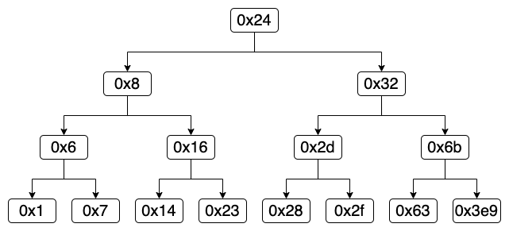

## 简介

这个 Lab 属于第三章 —— 程序的机器级表示，本章主要介绍了汇编的各种指令以及程序运行时栈和寄存器的变化。通过 C 的各种语法引入了对应的汇编指令，使得更易理解各种基本汇编指令以及 C 语法的底层实现。大部分汇编指令很直白，与常用的高级语言的语法都能对应，所以很快就可以熟悉上手； switch 语句比较复杂，多了一个跳转表需要处理；浮点数有自己的寄存器和指令，在函数调用的时候需要多加注意。

本章整体能够比较流畅地看下来，每一部分讲解完成之后都会有对应的练习题帮助加深理解和记忆，感觉比大学时候轻松很多。（可能是本章依旧比较简单，没有深入太多；也有可能大学学过了，还残留着部分知识；更有可能是心态变化了，课程没有那么繁重，每天只需要用 2 小时学习即可）

## 疑惑点回顾

本章遇到几个印象深刻的疑惑点，先记录一下，部分还没有找到答案。

### 栈帧对齐

第一个疑惑点在函数调用这块（`P173`），主要是在被调用之前需要将栈帧按 16 字节对齐。

```c
long Q(long x);

long P(long x, long y) {
	long u = Q(y);
	long v = Q(x);
	return u + v;
}
```

以上 C 代码生成的汇编代码如下（隐去了与本处无关的部分）：

```asm
P:
	pushq	%rbp
	pushq	%rbx
	subq	$8, %rsp
	movq	%rdi, %rbp
	movq	%rsi, %rdi
	call	Q@PLT
	movq	%rax, %rbx
	movq	%rbp, %rdi
	call	Q@PLT
	addq	%rbx, %rax
	addq	$8, %rsp
	popq	%rbx
	popq	%rbp
	ret
```

可以发现汇编代码第 4 行 (`subq	$8, %rsp`) 在栈中分配了 8 个字节（这一行书上的注释为：对齐栈帧），没有对应的 C 代码，同时后面也没有使用。所以当时就十分好奇为什么会生成这样的代码，即使有注释还是不明白是什么意思。

经过本地各种尝试和搜索后了解到：这样是为了将栈帧按 16 字节对齐。函数调用时， `%rsp` 要整除 16 才能成功，即在调用函数 P (`call P`) 之前， `%rsp` 必定是 16 的整数倍。运行 `call P` 时会将返回地址入栈 (`P165`) （但这一部分仍然算在调用者的栈帧内）。这时进入了被调用的函数 P 开始位置，但此时 `%rsp` 模 16 余 8 ，而在 P 保存寄存器 `%rbp` 和 `%rsx` 后（入栈 16 字节数据）， `%rsp` 模 16 仍然余 8 ，而后续在调用函数 Q 前再无出入栈的操作，所以为了按 16 字节对齐，需要再在栈上分配 8 字节的空间 (`subq	$8, %rsp`)。

后面在数据对齐部分 (`P191`) 也讲到这一知识点：

- 任何内存分配函数 (`alloca`, `malloc`, `calloc` , `realloc`) 生成的块的起始地址都必须是 16 的倍数
- 大多数函数的栈帧边界都必须是 16 字节的倍数（有一些例外）

### 数组分配

第二个疑惑点在缓冲区溢出这块（`P195`），表现形式和第一个疑惑点一样，都是在栈上多分配了一些空间，但这次表现不同，没找到原因（在这里花费好几小时，仍然没有找到答案，先暂时搁置）。

```c
char *gets(char *s);

void echo() {
    // 1. 数组的大小合法的任何数也不影响这种模式
    // 2. 数组的类型换成其他基本类型也不影响这种模式
    char buf[8];
    gets(buf);
}
```

以上 C 代码生成的汇编代码如下（隐去了与本处无关的部分）：

```asm
echo:
    subq    $24, %rsp
    leaq    8(%rsp), %rdi
    call    gets@PLT
    addq    $24, %rsp
    ret
```

可以发现虽然仍旧是按照 16 字节对齐，但是多分配了 16 字节的空间，依照前面的对齐要求，此处我们分配了 8 字节数组后已经对齐，应该是不需要再多分配空间了。

经过本地各种组合尝试后发现：只有定义了数组会这样（与数组类型无关），基本都会在数组末尾的前面留下一部分不使用的空间。猜测可能与 GCC 的栈破坏检测特性有关 (`P199`)，但不关闭这个特性，仍旧会在金丝雀值的前面有不使用的空间。

不关闭栈破坏检测的汇编代码如下（隐去了与本处无关的部分）：

```asm
echo:
    subq    $24, %rsp
    movq    %fs:40, %rax
    movq    %rax, 8(%rsp)
    xorl    %eax, %eax
    movq    %rsp, %rdi
    call    gets@PLT
    movq    8(%rsp), %rax
    xorq    %fs:40, %rax
    jne     .L4
    addq    $24, %rsp
    ret
```

### 浮点数类型转换

`P208` 处讲解了 GCC 生成的浮点数类型转换的汇编代码有两行，而没有使用一条汇编指令直接进行转换。作者也在书中说明不清楚为什么这样处理：

> 我们不太清楚 GCC 为什么会生成这样的代码，这样做既没有好处，也没有必要在 XMM 寄存器中把这个值复制一遍。

## 准备

可以在 [官网](http://csapp.cs.cmu.edu/3e/labs.html) 下载 bomblab 相关的程序。

本次需要使用的程序依旧需要在 Docker 中运行，将本地 Lab 的目录挂载进容器中即可：

```shell script
docker run -ti -v {PWD}:/csapp ubuntu:18.04
```

进入容器后需要安装 `gdb` ：

```shell script
apt-get update && apt-get -y install gdb
```

然后就可以愉快的开始闯关了。

## 闯关

本次 Lab 给了待使用的 `bomb` 程序及其对应的 `main` 部分，查看 `main.c` 文件，可以发现总共有 6 个字符串需要输入，必须全部正确才能正确通过这关。 [Bomb Lab writeup](http://csapp.cs.cmu.edu/3e/bomblab.pdf) 中给了提示，我们可以使用 `gdb`, `objdump -t`, `objdump -d`, `strings` 辅助我们通过这关。（这些也在 `main.c` 文件开头介绍过）

首先，我们运行 `gdb bomb` 开始调试，进入后可以输入 `help` 来获取不同指令的帮助文档，也可以查看书本 `P194` 进行相关操作。

然后调试获取所需的 6 个字符串。

### 获取第一个字符串

`main.c` 中给出了第一个字符串将在 `phase_1` 中进行校验，所以我们需要在 `phase_1` 入口处打上断点，然后运行程序使其进入 `phase_1` 函数：

```shell script
# 在函数 phase_1 入口处打上断点
(gdb) break phase_1
Breakpoint 1 at 0x400ee0
# 运行 bomb
(gdb) run
Starting program: /csapp/bomblab/bomb
warning: Error disabling address space randomization: Operation not permitted
Welcome to my fiendish little bomb. You have 6 phases with
which to blow yourself up. Have a nice day!
# 程序提示输入第一个字符串，我们暂时还不知道，所以随便输入一个
idealism-xxm

# 程序停在了第一个断点处：函数 phase_1 入口
Breakpoint 1, 0x0000000000400ee0 in phase_1 ()
```

此时我们需要使用 `disas` 查看函数 `phase_1` 的汇编代码：

```shell script
# 获取 phase_1 函数的汇编代码
(gdb) disas
Dump of assembler code for function phase_1:
=> 0x400ee0 <+0>:   sub    $0x8,%rsp
   0x400ee4 <+4>:   mov    $0x402400,%esi
   0x400ee9 <+9>:   callq  0x401338 <strings_not_equal>
   0x400eee <+14>:  test   %eax,%eax
   0x400ef0 <+16>:  je     0x400ef7 <phase_1+23>
   0x400ef2 <+18>:  callq  0x40143a <explode_bomb>
   0x400ef7 <+23>:  add    $0x8,%rsp
   0x400efb <+27>:  retq
End of assembler dump.
```

查看汇编代码，我们发现内部调用了 `strings_not_equal` 来比较两个字符串是否相等，该函数接收两个参数，分别放在 `%edi` (我们输入的字符串的起始地址) 和 `%edi` (待比较字符串的起始地址) 中，如果这两个字符串不等，则会调用 `explode_bomb` 引爆炸弹。

`mov $0x402400,%esi` 表明比较字符串的起始地址为 `0x402400` ，所以我们只需要查看这个地址开始的一段字符串即可获取第一个字符串。然后我们打印这个地址开始的 100 个字节对应的字符串：

```shell script
(gdb) print * (char *) 0x402400@100
$1 = "Border relations with Canada have never been better.\000\000\000\000Wow! You've defused the secret stage!\000flyers"
```

可以获取第一个字符串为：`Border relations with Canada have never been better.`

### 获取第二个字符串

我们在上一步获取了第一个字符串，此时我们可以开始获取第二个字符串。让我们重新运行程序 (`gdb bomb`)，在 `phase_2` 入口处打上断点，然后运行程序使其进入 `phase_2` 函数：

```shell script
# 在函数 phase_2 入口处打上断点
(gdb) break phase_2
Breakpoint 1 at 0x400efc
# 运行程序
(gdb) run
Starting program: /csapp/bomblab/bomb
warning: Error disabling address space randomization: Operation not permitted
Welcome to my fiendish little bomb. You have 6 phases with
which to blow yourself up. Have a nice day!
# 输入上一步获得的字符串
Border relations with Canada have never been better.
Phase 1 defused. How about the next one?
# 由于还不知道第二个字符串，所以随便输入以便进入函数 phase_2
idealism-xxm

Breakpoint 1, 0x0000000000400efc in phase_2 ()
```

此时我们需要使用 `disas` 查看函数 `phase_2` 的汇编代码：

```shell script
# 获取 phase_2 函数的汇编代码
(gdb) disas
Dump of assembler code for function phase_2:
=> 0x400efc <+0>:  push   %rbp
   0x400efd <+1>:  push   %rbx
   0x400efe <+2>:  sub    $0x28,%rsp
   0x400f02 <+6>:  mov    %rsp,%rsi
   0x400f05 <+9>:  callq  0x40145c <read_six_numbers>
   # 省略暂时不关注的代码
   ...
End of assembler dump.
```

可以发现最开始分配了 40 个字节空间，然后调用了函数 `read_six_numbers` ，这个函数的参数是 `%rdi` (输入的字符串) 和 `%rsi` (刚刚分配的空间) 。根据现有条件判断应该是要从输入的字符串中读取 6 个数字，并存储在我们刚刚分配的空间中。

接下来我们就需要给函数 `read_six_numbers` 打断点，继续运行至函数 `read_six_numbers` 入口处，查看其如何将 6 个数读取出来：

```shell script
# 在函数 read_six_numbers 入口处打上断点
(gdb) break read_six_numbers
Breakpoint 2 at 0x40145c
# 继续运行
(gdb) continue
Continuing.

Breakpoint 2, 0x000000000040145c in read_six_numbers ()
# 获取 read_six_numbers 函数的汇编代码
(gdb) disas
Dump of assembler code for function read_six_numbers:
=> 0x40145c <+0>:   sub    $0x18,%rsp
   0x401460 <+4>:   mov    %rsi,%rdx
   0x401463 <+7>:   lea    0x4(%rsi),%rcx
   0x401467 <+11>:  lea    0x14(%rsi),%rax
   0x40146b <+15>:  mov    %rax,0x8(%rsp)
   0x401470 <+20>:  lea    0x10(%rsi),%rax
   0x401474 <+24>:  mov    %rax,(%rsp)
   0x401478 <+28>:  lea    0xc(%rsi),%r9
   0x40147c <+32>:  lea    0x8(%rsi),%r8
   0x401480 <+36>:  mov    $0x4025c3,%esi
   0x401485 <+41>:  mov    $0x0,%eax
   0x40148a <+46>:  callq  0x400bf0 <__isoc99_sscanf@plt>
   0x40148f <+51>:  cmp    $0x5,%eax
   0x401492 <+54>:  jg     0x401499 <read_six_numbers+61>
   0x401494 <+56>:  callq  0x40143a <explode_bomb>
   0x401499 <+61>:  add    $0x18,%rsp
   0x40149d <+65>:  retq
End of assembler dump.
```

初步观察汇编代码，发现是通过 `sscanf` 函数从我们输入的字符串中获取值，接下来就是判断这 6 个数字分别存在了什么位置。

书中 `P120` 讲解了函数的前六个入参数分别存储在 `rdi`, `rsi`, `rdx`, `rcx`, `r8`, `r9` 中， `P164` 讲解了从第 7 个入参开始，参数存储在栈顶。

我们先判断函数 `sscanf` 的入参分别是什么：

- 第一个入参 (`%rdi`): 后续没有改动该寄存器的地方，那么第一个入参就是我们输入的字符串
- 第二个入参 (`%rsi`): 可以发现 `%esi` 被指令 `mov $0x4025c3,%esi` 修改了，说明第二个参数仍然是字符串，结合函数定义可知该字符串是模式串，用于读取数字。我们使用 `(gdb) print * (char *) 0x4025c3@20` 查看其开始的 20 个字符，可得模式串为： `%d %d %d %d %d %d`
- 第三个入参 (`%rdx`): 可以发现 `%rdx` 被指令 `mov %rsi,%rdx` 修改了，说明第三个参数是相对传入指针偏移量为 0 的位置
- 第四个入参 (`%rcx`): 可以发现 `%rcx` 被指令 `lea 0x4(%rsi),%rcx` 修改了，说明第四个参数是相对传入指针偏移量为 4 的位置
- 第五个入参 (`%r8`): 可以发现 `%r8` 被指令 `lea 0x8(%rsi),%r8` 修改了，说明第五个参数是相对传入指针偏移量为 8 的位置
- 第六个入参 (`%r9`): 可以发现 `%r9` 被指令 `lea 0xc(%rsi),%r9` 修改了，说明第六个参数是相对传入指针偏移量为 12 的位置
- 第七个入参 (`(%rsp)`): 可以发现 `(%rsp)` 被指令 (`lea 0x10(%rsi),%rax`, `mov %rax,(%rsp)`) 修改了，说明第七个参数是相对传入指针偏移量为 16 的位置
- 第八个入参 (`0x8(%rsp)`): 可以发现 `0x8(%rsp)` 被指令 (`lea 0x14(%rsi),%rax` `mov %rax,0x8(%rsp)`) 修改了，说明第八个参数是相对传入指针偏移量为 20 的位置

由此可知，传入指针指向 `int[6]` 的数组的起始地址（假设以 `arr` 代表该数组），输入串是六个以空格分割的 32 位有符号数字 (`int`)，并且这个六个数字将会按顺序存在 `arr` 数组中。

此时我们再看函数 `phase_2` 完整的汇编代码：

```shell script
(gdb) disas
Dump of assembler code for function phase_2:
=> 0x400efc <+0>:   push   %rbp
   0x400efd <+1>:   push   %rbx
   0x400efe <+2>:   sub    $0x28,%rsp
   0x400f02 <+6>:   mov    %rsp,%rsi
   0x400f05 <+9>:   callq  0x40145c <read_six_numbers>
   0x400f0a <+14>:  cmpl   $0x1,(%rsp)
   0x400f0e <+18>:  je     0x400f30 <phase_2+52>
   0x400f10 <+20>:  callq  0x40143a <explode_bomb>
   0x400f15 <+25>:  jmp    0x400f30 <phase_2+52>
   0x400f17 <+27>:  mov    -0x4(%rbx),%eax
   0x400f1a <+30>:  add    %eax,%eax
   0x400f1c <+32>:  cmp    %eax,(%rbx)
   0x400f1e <+34>:  je     0x400f25 <phase_2+41>
   0x400f20 <+36>:  callq  0x40143a <explode_bomb>
   0x400f25 <+41>:  add    $0x4,%rbx
   0x400f29 <+45>:  cmp    %rbp,%rbx
   0x400f2c <+48>:  jne    0x400f17 <phase_2+27>
   0x400f2e <+50>:  jmp    0x400f3c <phase_2+64>
   0x400f30 <+52>:  lea    0x4(%rsp),%rbx
   0x400f35 <+57>:  lea    0x18(%rsp),%rbp
   0x400f3a <+62>:  jmp    0x400f17 <phase_2+27>
   0x400f3c <+64>:  add    $0x28,%rsp
   0x400f40 <+68>:  pop    %rbx
   0x400f41 <+69>:  pop    %rbp
   0x400f42 <+70>:  retq
End of assembler dump.
```

调用完 `read_six_numbers` 函数后，我们已经将读取的六个数字按顺序存储在数组 `arr` 中，分别对应栈中的值： `(%rsp)`, `0x4(%rsp)`, `0x8(%rsp)`, `0xc(%rsp)`, `0x10(%rsp)`, `0x14(%rsp)` 。接下来我们依次判断每个值是多少：

- 第一个数 (`arr[0]: (%rsp)`): 这个数通过 `cmpl $0x1,(%rsp)` 进行判断，紧接着运行跳转指令 `je 0x400f30 <phase_2+52>` 判断是否跳过引爆炸弹的函数，表明当 `(%rsp)` 的值等于 `1` 时不会触发爆炸，所以第一个数为： `1`
- 第二个数 (`arr[1]: 0x4(%rsp)`): 通过第一个数的判断后，成功跳转到 `0x400f30 <+52>` 处，这里的代码类似： `int *a = arr + 1; int *b = arr + 7;` ，然后跳转到 `0x400f17 <+27>` 处，连续三条指令表明判断 `a[-1] + a[-1]` 是否等于 `a[0]` （即判断 `arr[1] == arr[0] + arr[0]` 是否成立），成立时跳过引爆炸弹的函数，表明当 `0x4(%rsp)` 的值等于 `2` 时不会触发爆炸，所以第二个数为： `2`
- 第三个数 (`arr[1]: 0x4(%rsp)`): 通过第二个数的判断后，成功跳转到 `0x400f25 <+41>` 处，连续三条指令表明先执行了类似 `a = a + 1` 的操作，然后判断 `a == b` 是否成立（即判断 `a` 是否指向了 `arr + 6`），成立时会接着运行并跳转至 `0x400f3c <+64>` 处（表明通过了所有判断，字符串合法）；不成立时会紧接着跳转至 `0x400f17 <+27>` 处，继续前一步中的判断。所以这里其实是一个循环，只有当前数是前一个数的 2 倍时才不会引爆炸弹，所以第三个数为： `4`

综上可知六个数分别为： `1`, `2`, `4`, `8`, `16`, `32` ，对应的字符串为： `1 2 4 8 16 32` 。

重新运行程序，依次输入前两个字符串，然后发现输出了 `That's number 2.  Keep going!` ，表明我们第二个字符串也成功获取到了。

### 获取第三个字符串

我们在通过前面的步骤成功获取了前两个字符串，此时我们可以开始获取第三个字符串。让我们重新运行程序 (`gdb bomb`)，在 `phase_3` 入口处打上断点，然后运行程序使其进入函数 `phase_3`，并获取 `phase_3` 汇编代码：

```shell script
...
Breakpoint 1, 0x0000000000400f71 in phase_3 ()
# 获取函数 phase_3 的汇编代码
(gdb) disas
Dump of assembler code for function phase_3:
=> 0x400f43 <+0>:    sub    $0x18,%rsp
   0x400f47 <+4>:    lea    0xc(%rsp),%rcx
   0x400f4c <+9>:    lea    0x8(%rsp),%rdx
   0x400f51 <+14>:   mov    $0x4025cf,%esi
   0x400f56 <+19>:   mov    $0x0,%eax
   0x400f5b <+24>:   callq  0x400bf0 <__isoc99_sscanf@plt>
   0x400f60 <+29>:   cmp    $0x1,%eax
   0x400f63 <+32>:   jg     0x400f6a <phase_3+39>
   0x400f65 <+34>:   callq  0x40143a <explode_bomb>
   0x400f6a <+39>:   cmpl   $0x7,0x8(%rsp)
   0x400f6f <+44>:   ja     0x400fad <phase_3+106>
   0x400f71 <+46>:   mov    0x8(%rsp),%eax
   0x400f75 <+50>:   jmpq   *0x402470(,%rax,8)
   0x400f7c <+57>:   mov    $0xcf,%eax
   0x400f81 <+62>:   jmp    0x400fbe <phase_3+123>
   0x400f83 <+64>:   mov    $0x2c3,%eax
   0x400f88 <+69>:   jmp    0x400fbe <phase_3+123>
   0x400f8a <+71>:   mov    $0x100,%eax
   0x400f8f <+76>:   jmp    0x400fbe <phase_3+123>
   0x400f91 <+78>:   mov    $0x185,%eax
   0x400f96 <+83>:   jmp    0x400fbe <phase_3+123>
   0x400f98 <+85>:   mov    $0xce,%eax
   0x400f9d <+90>:   jmp    0x400fbe <phase_3+123>
   0x400f9f <+92>:   mov    $0x2aa,%eax
   0x400fa4 <+97>:   jmp    0x400fbe <phase_3+123>
   0x400fa6 <+99>:   mov    $0x147,%eax
   0x400fab <+104>:  jmp    0x400fbe <phase_3+123>
   0x400fad <+106>:  callq  0x40143a <explode_bomb>
   0x400fb2 <+111>:  mov    $0x0,%eax
   0x400fb7 <+116>:  jmp    0x400fbe <phase_3+123>
   0x400fb9 <+118>:  mov    $0x137,%eax
   0x400fbe <+123>:  cmp    0xc(%rsp),%eax
   0x400fc2 <+127>:  je     0x400fc9 <phase_3+134>
   0x400fc4 <+129>:  callq  0x40143a <explode_bomb>
   0x400fc9 <+134>:  add    $0x18,%rsp
   0x400fcd <+138>:  retq
End of assembler dump.
```

`0x400f43 <+0>` ~ `0x400f65 <+34>`: 和上一步类似，就不赘述了，主要是通过 `sscanf` 获取输入字符串的两个 32 位有符号整数，假设分别存储在 `a` (`0x8(%rsp)`) 和 `b` (`0xc(%rsp)`) 中。如果没有成功获取两个整数，那么就会引爆炸弹，无法继续运行。

`0x400f6a <+39>` ~ `0x400f6f <+44>`: 主要是判断 `a <= 7` 是否成立，成立则可继续运行；不成立则跳转至 `0x400fad <+106>` 引爆炸弹，无法继续运行。

`0x400f71 <+46>` ~ `0x400f75 <+50>`: 主要是通过 `a` 的值计算如何跳转，即通过 `0~7` 计算跳转的位置，很明显是 `switch` 语句的汇编代码。那么 `0x402470` 就是跳转表的起始位置，我们运行 `print /x * 0x402470@16` 查看跳转表的相关数据：

```shell script
# 查看 0x402470 开始的 16 个字节
(gdb) print /x * 0x402470@16
$1 = {0x400f7c, 0x0, 0x400fb9, 0x0, 0x400f83, 0x0, 0x400f8a, 0x0, 0x400f91, 0x0, 0x400f98, 0x0, 0x400f9f, 0x0, 0x400fa6, 0x0}
```

按照顺序对应一下可以发现 `a` 对应的跳转位置及对应的代码效果关系如下：

| a | 跳转位置 | 相关代码将 c 赋值为 |
| --- | --- | --- |
| 0 | `0x400f7c <+57>` | `0xcf`(`207`) |
| 1 | `0x400fb9 <+118>` | `0x137`(`311`) |
| 2 | `0x400f83 <+64>` | `0x2c3`(`707`) |
| 3 | `0x400f8a <+71>` | `0x100`(`256`) |
| 4 | `0x400f91 <+78>` | `0x185`(`389`) |
| 5 | `0x400f98 <+85>` | `0xce`(`206`) |
| 6 | `0x400f9f <+92>` | `0x2aa`(`682`) |
| 7 | `0x400fa6 <+99>` | `0x147`(`327`) |

`switch` 语句执行完毕后，将运行 `0x400fbe <+123>` ~ `0x400fc4 <+129>` ，主要是判断 `b == c` 是否成立，不成立则引爆炸弹，不再继续运行；成立则通过跳过引爆炸弹的操作，成功通过校验。

综上，第三个字符串有 8 个合法值：`0 207`, `1 311`, `2 707`, `3 256`, `4 389`, `5 206`, `6 682`, `7 327` 。

我们重新运行程序，在输入第三个字符串时，随意输入上面 8 个字符串中的一个，控制台都会输出 `Halfway there!` 告诉我们第三个字符串成功获取。

### 获取第四个字符串

我们在通过前面的步骤成功获取了前三个字符串，此时我们可以开始获取第四个字符串。让我们重新运行程序 (`gdb bomb`)，在 `phase_4` 入口处打上断点，然后运行程序使其进入函数 `phase_4`，并获取 `phase_4` 汇编代码：

```shell script
...
Breakpoint 1, 0x000000000040100c in phase_4 ()
# 获取函数 phase_4 的汇编代码
(gdb) disas
Dump of assembler code for function phase_4:
=> 0x40100c <+0>:   sub    $0x18,%rsp
   0x401010 <+4>:   lea    0xc(%rsp),%rcx
   0x401015 <+9>:   lea    0x8(%rsp),%rdx
   0x40101a <+14>:  mov    $0x4025cf,%esi
   0x40101f <+19>:  mov    $0x0,%eax
   0x401024 <+24>:  callq  0x400bf0 <__isoc99_sscanf@plt>
   0x401029 <+29>:  cmp    $0x2,%eax
   0x40102c <+32>:  jne    0x401035 <phase_4+41>
   0x40102e <+34>:  cmpl   $0xe,0x8(%rsp)
   0x401033 <+39>:  jbe    0x40103a <phase_4+46>
   0x401035 <+41>:  callq  0x40143a <explode_bomb>
   0x40103a <+46>:  mov    $0xe,%edx
   0x40103f <+51>:  mov    $0x0,%esi
   0x401044 <+56>:  mov    0x8(%rsp),%edi
   0x401048 <+60>:  callq  0x400fce <func4>
   0x40104d <+65>:  test   %eax,%eax
   0x40104f <+67>:  jne    0x401058 <phase_4+76>
   0x401051 <+69>:  cmpl   $0x0,0xc(%rsp)
   0x401056 <+74>:  je     0x40105d <phase_4+81>
   0x401058 <+76>:  callq  0x40143a <explode_bomb>
   0x40105d <+81>:  add    $0x18,%rsp
   0x401061 <+85>:  retq
End of assembler dump.
```

`0x40100c <+0>` ~ `0x40102c <+32>`: 和前面类似，主要是通过 `sscanf` 获取输入字符串的两个 32 位有符号整数，假设分别存储在 `a` (`0x8(%rsp)`) 和 `b` (`0xc(%rsp)`) 中。如果没有成功获取两个整数，那么就会引爆炸弹，无法继续运行。

`0x40102e <+34>` ~ `0x401033 <+39>`: 主要是判断 `0 <= a <= 14` 是否成立（注意跳转使用的是 `jbe` 指令，所以是把 `a` 当作无符号数时必须小于等于 `14` ，即 `a` 必须非负且小于等于 `14`），成立则跳转至 `0x40103a <+46>` 继续运行；不成立则会引爆炸弹，无法继续运行。

`0x40103a <+46>` ~ `0x401048 <+60>`: 主要是调用函数 `func4` ，该函数签名大致为 `int func4(int i, int j, int k)` 。我们调用语句大致为 `int c = func4(a, 0, 14);` 。

`0x40104d <+65>` ~ `0x40104f <+67>`: 判断 `c == 0` 是否成立 ，不成立则引爆炸弹，成立时继续运行。此时我们确定 `func4` 函数的调用结果必须为 `0` ，从而反推出第一个数 (`a`) 的值。

`0x401051 <+69>` ~ `0x401056 <+74>`: 判断 `b == 0` 是否成立，不成立则引爆炸弹，成立时继续运行并可顺利结束。此时我们已经确定了第二个数 (`b`) 为 `0` 。

此时我们已经确认了第二个数的值，还需确认第一个数的值。我们需要给 `func4` 入口处打上断点，并运行至 `func4` 入口处，查看 `func4` 的汇编代码：

```shell script
# 在函数 func4 入口处打上断点
(gdb) break func4
Breakpoint 2 at 0x400fce
# 继续运行至 func4 处打上断点
(gdb) continue
Continuing.

Breakpoint 2, 0x0000000000400fce in func4 ()
# 获取函数 func4 的汇编代码
(gdb) disas
Dump of assembler code for function func4:
=> 0x400fce <+0>:   sub    $0x8,%rsp
   0x400fd2 <+4>:   mov    %edx,%eax
   0x400fd4 <+6>:   sub    %esi,%eax
   0x400fd6 <+8>:   mov    %eax,%ecx
   0x400fd8 <+10>:  shr    $0x1f,%ecx
   0x400fdb <+13>:  add    %ecx,%eax
   0x400fdd <+15>:  sar    %eax
   0x400fdf <+17>:  lea    (%rax,%rsi,1),%ecx
   0x400fe2 <+20>:  cmp    %edi,%ecx
   0x400fe4 <+22>:  jle    0x400ff2 <func4+36>
   0x400fe6 <+24>:  lea    -0x1(%rcx),%edx
   0x400fe9 <+27>:  callq  0x400fce <func4>
   0x400fee <+32>:  add    %eax,%eax
   0x400ff0 <+34>:  jmp    0x401007 <func4+57>
   0x400ff2 <+36>:  mov    $0x0,%eax
   0x400ff7 <+41>:  cmp    %edi,%ecx
   0x400ff9 <+43>:  jge    0x401007 <func4+57>
   0x400ffb <+45>:  lea    0x1(%rcx),%esi
   0x400ffe <+48>:  callq  0x400fce <func4>
   0x401003 <+53>:  lea    0x1(%rax,%rax,1),%eax
   0x401007 <+57>:  add    $0x8,%rsp
   0x40100b <+61>:  retq
End of assembler dump.
```

这一段代码比较繁琐，而且涉及到递归调用，直接根据每块指令看不太容易理解，所以直接可以先直译出相关的 C 代码：

```c
inf func4(int i, int j, int k) {
    // 0x400fd2 <+4>:  mov    %edx,%eax
    // 0x400fd4 <+6>:  sub    %esi,%eax
    int l = k - j;

    // 0x400fd6 <+8>:  mov    %eax,%ecx
    // 0x400fd8 <+10>: shr    $0x1f,%ecx
    // 由于 shr 是逻辑右移，而 C 语言是算术右移动，所以最后还要再与上 0x1
    // 这一句相当于取符号位
    int m = (l >> 31) & 0x1;

    // 0x400fdb <+13>: add    %ecx,%eax
    // 0x400fdd <+15>: sar    %eax
    l = (l + m) >> 1;
    
    // 0x400fdf <+17>: lea    (%rax,%rsi,1),%ecx
    m = l + j;

    // 0x400fe2 <+20>: cmp    %edi,%ecx
    // 0x400fe4 <+22>: jle    0x400ff2 <func4+36>
    if (l <= i) {

        // 0x400ff7 <+41>: cmp    %edi,%ecx
        // 0x400ff9 <+43>: jge    0x401007 <func4+57>
        if (l >= i) {

            // 0x400ff2 <+36>: mov    $0x0,%eax
            return 0;
        } else {

            // 0x400ffb <+45>: lea    0x1(%rcx),%esi
            // 0x400ffe <+48>: callq  0x400fce <func4>
            // 0x401003 <+53>: lea    0x1(%rax,%rax,1),%eax
            return 2 * func4(i, j + 1, k) + 1
        }
    } else {

        // 0x400fe6 <+24>: lea    -0x1(%rcx),%edx
        // 0x400fe9 <+27>: callq  0x400fce <func4>
        // 0x400fee <+32>: add    %eax,%eax
        return 2 * func4(i, j, k - 1)
    }
}
```

直译后的代码还是有点难懂（难怪 `main.c` 里要问数学好不好），但是我们知道这个函数需要返回 `0` 才行，找到对应的分支语句，可以反推出 `i == l` ， `i` 就是我们需要确定的值，而 `l` 只与 `j`, `k` 有关，并且第一次调用 `func4` 时 `j = 0`, `k = 14` ，根据函数最开始的语句可以算出 `l = 7` ，所以 `i` 的值也为 `7` ，并且满足 `0 <= i <= 14` ，所以 `i = 7` 是一个合法的解。（已经获取了 `func4` 的函数，所以可以直接枚举 `i = 0 ~ 14` ，可得合法的解为： `0`, `1`, `3`, `7`）

至此我们已经推断出了字符串中两个数字的值分别为 `7` 和 `0` ，那么第四个字符串为： `7 0` 。

### 获取第五个字符串

我们在通过前面的步骤成功获取了前四个字符串，此时我们可以开始获取第五个字符串。让我们重新运行程序 (`gdb bomb`)，在 `phase_5` 入口处打上断点，然后运行程序使其进入函数 `phase_5`，并获取 `phase_5` 汇编代码：

```shell script
...
Breakpoint 1, 0x0000000000401062 in phase_5 ()
# 获取函数 phase_5 的汇编代码
(gdb) disas
Dump of assembler code for function phase_5:
=> 0x401062 <+0>:    push   %rbx
   0x401063 <+1>:    sub    $0x20,%rsp
   0x401067 <+5>:    mov    %rdi,%rbx
   0x40106a <+8>:    mov    %fs:0x28,%rax
   0x401073 <+17>:   mov    %rax,0x18(%rsp)
   0x401078 <+22>:   xor    %eax,%eax
   0x40107a <+24>:   callq  0x40131b <string_length>
   0x40107f <+29>:   cmp    $0x6,%eax
   0x401082 <+32>:   je     0x4010d2 <phase_5+112>
   0x401084 <+34>:   callq  0x40143a <explode_bomb>
   0x401089 <+39>:   jmp    0x4010d2 <phase_5+112>
   0x40108b <+41>:   movzbl (%rbx,%rax,1),%ecx
   0x40108f <+45>:   mov    %cl,(%rsp)
   0x401092 <+48>:   mov    (%rsp),%rdx
   0x401096 <+52>:   and    $0xf,%edx
   0x401099 <+55>:   movzbl 0x4024b0(%rdx),%edx
   0x4010a0 <+62>:   mov    %dl,0x10(%rsp,%rax,1)
   0x4010a4 <+66>:   add    $0x1,%rax
   0x4010a8 <+70>:   cmp    $0x6,%rax
   0x4010ac <+74>:   jne    0x40108b <phase_5+41>
   0x4010ae <+76>:   movb   $0x0,0x16(%rsp)
   0x4010b3 <+81>:   mov    $0x40245e,%esi
   0x4010b8 <+86>:   lea    0x10(%rsp),%rdi
   0x4010bd <+91>:   callq  0x401338 <strings_not_equal>
   0x4010c2 <+96>:   test   %eax,%eax
   0x4010c4 <+98>:   je     0x4010d9 <phase_5+119>
   0x4010c6 <+100>:  callq  0x40143a <explode_bomb>
   0x4010cb <+105>:  nopl   0x0(%rax,%rax,1)
   0x4010d0 <+110>:  jmp    0x4010d9 <phase_5+119>
   0x4010d2 <+112>:  mov    $0x0,%eax
   0x4010d7 <+117>:  jmp    0x40108b <phase_5+41>
   0x4010d9 <+119>:  mov    0x18(%rsp),%rax
   0x4010de <+124>:  xor    %fs:0x28,%rax
   0x4010e7 <+133>:  je     0x4010ee <phase_5+140>
   0x4010e9 <+135>:  callq  0x400b30 <__stack_chk_fail@plt>
   0x4010ee <+140>:  add    $0x20,%rsp
   0x4010f2 <+144>:  pop    %rbx
   0x4010f3 <+145>:  retq
End of assembler dump.
```

`0x40106a <+8>` ~ `0x401073 <+17>`: 看到 `mov %fs:0x28,%rax` 就想起了这是栈破坏检测的相关代码 (`P199`) ，主要是检测栈是否被破坏，也说明了我们刚刚定义了一个数组，并且这个数组在后面会作为参数传入一个函数中

`0x401078 <+22>` ~ `0x401082 <+32>`: 主要判断我们输入的字符串的长度是否为 `6` ，不为 `6` 则引爆炸弹，否则继续运行后续代码

`0x4010d2 <+112>` ~ `0x4010d7 <+117>`: 将寄存器 `%eax` 赋值为 `0` （书中 `P123` 提到 `movl` 指令以寄存器作为目的时，它会把该寄存器的高位 4 字节设置为 `0` ，因此没必要使用 `movq $0x0, %rax`）

`0x40108b <+41>` ~ `0x4010ae <+76>`: 这一段是循环，主要是遍历输入字符串的 6 个字符 `ch` ，并取该字符的低 `4` 位作为一个下标 `index` ，然后将相对地址 `0x4024b0` 偏移为 `index` 的一个字节赋值给我们定义的数组中的对应位置（假设输入字符串为 `s` ，栈中数组的定义语句为 `char d[7];` ，地址 `0x4024b0` 对应的字符数组为 `chs` ，那么这一段循环的意思为 `d[i] = chs[s[i] & 0xf];`）
- `0x40108b <+41>`: 使用了 `MOVZ` 类指令，这类指令会把目的中剩余的字节填充为 `0` ；与其对应的 `MOVS` 类指令会通过符号扩展填充剩余的字节（即将源操作数的最高位进行赋值填充到目的中剩余的字节） `P123`
- `print * (char *) 0x4024b0@16`: 查看地址 `0x4024b0` 开始的 8 个字符为 `maduiersnfotvbyl`
- `0x4010ae <+76>`: `d[6] = '\0'` ，即把我们栈中定义的字符数组最后设置为 `0` ，表示其代表的字符串长度为 `6`

`0x4010b3 <+81>` ~ `0x4010c4 <+98>`: 判断字符串 `d` 与以地址 `0x40245e` 开始的字符串是否相等，不相等则引爆炸弹，相等则继续运行校验栈是否被破坏，然后通过第五个字符串的验证
- `print * (char *) 0x40245e@7`: 查看地址 `0x40245e` 开始的 7 个字符为 `flyers` （注意最后一个 `\0` 没有显示）

综上可知：我们需要生成的字符串 `d` 为 `flyers` ，可用于生成目标字符串的字母表为 `maduiersnfotvbyl` ，然后我们可以反推出我们可输入的字符的低 4 位，然后对照 `man ascii` 指令输出的表找出对应哪些可输入的字符。

| `i` | `d[i]` | `s[i] & 0xf` | 可输入字符 |
| --- | --- | --- | --- |
| `0` | `f` | `0x9` | `)` `9` `I` `Y` `i` `y` |
| `1` | `l` | `0xf` | `/` `?` `O` `_` `o` |
| `2` | `y` | `0xe` | `.` `>` `N` `^` `n` `~` |
| `3` | `e` | `0x5` | `%` `5` `E` `U` `e` `u` |
| `4` | `r` | `0x6` | `&` `6` `F` `V` `f` `v` |
| `5` | `s` | `0x7` | `'` `7` `G` `W` `g` `w` |

第五个字符串每个位置任意选取对应的可输入字符即可通过第五个校验。

### 获取第六个字符串

我们在通过前面的步骤成功获取了前五个字符串，此时我们可以开始获取第六个字符串。让我们重新运行程序 (`gdb bomb`)，在 `phase_6` 入口处打上断点，然后运行程序使其进入函数 `phase_6`，并获取 `phase_6` 汇编代码：

```shell script
...
Breakpoint 1, 0x00000000004010f4 in phase_6 ()
(gdb) disas
Dump of assembler code for function phase_6:
=> 0x4010f4 <+0>:    push   %r14
   0x4010f6 <+2>:    push   %r13
   0x4010f8 <+4>:    push   %r12
   0x4010fa <+6>:    push   %rbp
   0x4010fb <+7>:    push   %rbx
   0x4010fc <+8>:    sub    $0x50,%rsp
   0x401100 <+12>:   mov    %rsp,%r13
   0x401103 <+15>:   mov    %rsp,%rsi
   0x401106 <+18>:   callq  0x40145c <read_six_numbers>
   0x40110b <+23>:   mov    %rsp,%r14
   0x40110e <+26>:   mov    $0x0,%r12d
   0x401114 <+32>:   mov    %r13,%rbp
   0x401117 <+35>:   mov    0x0(%r13),%eax
   0x40111b <+39>:   sub    $0x1,%eax
   0x40111e <+42>:   cmp    $0x5,%eax
   0x401121 <+45>:   jbe    0x401128 <phase_6+52>
   0x401123 <+47>:   callq  0x40143a <explode_bomb>
   0x401128 <+52>:   add    $0x1,%r12d
   0x40112c <+56>:   cmp    $0x6,%r12d
   0x401130 <+60>:   je     0x401153 <phase_6+95>
   0x401132 <+62>:   mov    %r12d,%ebx
   0x401135 <+65>:   movslq %ebx,%rax
   0x401138 <+68>:   mov    (%rsp,%rax,4),%eax
   0x40113b <+71>:   cmp    %eax,0x0(%rbp)
   0x40113e <+74>:   jne    0x401145 <phase_6+81>
   0x401140 <+76>:   callq  0x40143a <explode_bomb>
   0x401145 <+81>:   add    $0x1,%ebx
   0x401148 <+84>:   cmp    $0x5,%ebx
   0x40114b <+87>:   jle    0x401135 <phase_6+65>
   0x40114d <+89>:   add    $0x4,%r13
   0x401151 <+93>:   jmp    0x401114 <phase_6+32>
   0x401153 <+95>:   lea    0x18(%rsp),%rsi
   0x401158 <+100>:  mov    %r14,%rax
   0x40115b <+103>:  mov    $0x7,%ecx
   0x401160 <+108>:  mov    %ecx,%edx
   0x401162 <+110>:  sub    (%rax),%edx
   0x401164 <+112>:  mov    %edx,(%rax)
   0x401166 <+114>:  add    $0x4,%rax
   0x40116a <+118>:  cmp    %rsi,%rax
   0x40116d <+121>:  jne    0x401160 <phase_6+108>
   0x40116f <+123>:  mov    $0x0,%esi
   0x401174 <+128>:  jmp    0x401197 <phase_6+163>
   0x401176 <+130>:  mov    0x8(%rdx),%rdx
   0x40117a <+134>:  add    $0x1,%eax
   0x40117d <+137>:  cmp    %ecx,%eax
   0x40117f <+139>:  jne    0x401176 <phase_6+130>
   0x401181 <+141>:  jmp    0x401188 <phase_6+148>
   0x401183 <+143>:  mov    $0x6032d0,%edx
   0x401188 <+148>:  mov    %rdx,0x20(%rsp,%rsi,2)
   0x40118d <+153>:  add    $0x4,%rsi
   0x401191 <+157>:  cmp    $0x18,%rsi
   0x401195 <+161>:  je     0x4011ab <phase_6+183>
   0x401197 <+163>:  mov    (%rsp,%rsi,1),%ecx
   0x40119a <+166>:  cmp    $0x1,%ecx
   0x40119d <+169>:  jle    0x401183 <phase_6+143>
   0x40119f <+171>:  mov    $0x1,%eax
   0x4011a4 <+176>:  mov    $0x6032d0,%edx
   0x4011a9 <+181>:  jmp    0x401176 <phase_6+130>
   0x4011ab <+183>:  mov    0x20(%rsp),%rbx
   0x4011b0 <+188>:  lea    0x28(%rsp),%rax
   0x4011b5 <+193>:  lea    0x50(%rsp),%rsi
   0x4011ba <+198>:  mov    %rbx,%rcx
   0x4011bd <+201>:  mov    (%rax),%rdx
   0x4011c0 <+204>:  mov    %rdx,0x8(%rcx)
   0x4011c4 <+208>:  add    $0x8,%rax
   0x4011c8 <+212>:  cmp    %rsi,%rax
   0x4011cb <+215>:  je     0x4011d2 <phase_6+222>
   0x4011cd <+217>:  mov    %rdx,%rcx
   0x4011d0 <+220>:  jmp    0x4011bd <phase_6+201>
   0x4011d2 <+222>:  movq   $0x0,0x8(%rdx)
   0x4011da <+230>:  mov    $0x5,%ebp
   0x4011df <+235>:  mov    0x8(%rbx),%rax
   0x4011e3 <+239>:  mov    (%rax),%eax
   0x4011e5 <+241>:  cmp    %eax,(%rbx)
   0x4011e7 <+243>:  jge    0x4011ee <phase_6+250>
   0x4011e9 <+245>:  callq  0x40143a <explode_bomb>
   0x4011ee <+250>:  mov    0x8(%rbx),%rbx
   0x4011f2 <+254>:  sub    $0x1,%ebp
   0x4011f5 <+257>:  jne    0x4011df <phase_6+235>
   0x4011f7 <+259>:  add    $0x50,%rsp
   0x4011fb <+263>:  pop    %rbx
   0x4011fc <+264>:  pop    %rbp
   0x4011fd <+265>:  pop    %r12
   0x4011ff <+267>:  pop    %r13
   0x401201 <+269>:  pop    %r14
   0x401203 <+271>:  retq
End of assembler dump.
```

第一眼看到这么长的汇编代码有点懵，但大概一看没有太复杂的逻辑，还有前面遇到过的函数，所以还是冷静下来继续分析，由于拆开很难看懂，所以还是需要直译成 C 代码再研究（部分判断转换成等价的语句，减少缩进）。为了细化每一块的功能，将把源代码拆成多部分进行分析。

`0x401100 <+12>` ~ `0x401106 <+18>`: 调用函数 `read_six_numbers` 从输入的字符串读入 6 个数字，并按顺序存储在 `nums` 中

直译的 C 代码如下：

```c
void phase_6(char *s) {
    int *ap, *bp, *endp;
    int c, d, e;
    struct Node **nextpp, **endpp;
    struct Node *nodep, *curp;
    struct Node *arr[6];
    int nums[6];

    // 0x401100 <+12>:   mov    %rsp,%r13
    ap = nums;

    // 0x401103 <+15>:   mov    %rsp,%rsi
    // 0x401106 <+18>:   callq  0x40145c <read_six_numbers>
    read_six_numbers(s, nums);
    ...
}
```

`0x40110b <+23>` ~ `0x40114d <+89>`: 主要是判断 `nums` 中的数字是否全都满足 `0 <= nums[i] <= 6` 且互不相等

直译的 C 代码如下：

```c
    ...
    // 0x40110b <+23>:   mov    %rsp,%r14
    bp = nums;
    // 0x40110e <+26>:   mov    $0x0,%r12d
    c = 0;

    whilt (true) {
        // 0x401114 <+32>:   mov %r13,%rbp
        // 0x401117 <+35>:   mov 0x0(%r13),%eax
        // 0x40111b <+39>:   sub $0x1,%eax
        // 0x40111e <+42>:   cmp $0x5,%eax
        // 0x401121 <+45>:   jbe 0x401128 <phase_6+52>
        if ((unsigned) (*ap - 1) > 5)) {
            // 0x401123 <+47>:   callq  0x40143a <explode_bomb>
            explode_bomb();
        }
        
        // 0x401128 <+52>:   add    $0x1,%r12d
        c += 1;
        // 0x40112c <+56>:   cmp    $0x6,%r12d
        // 0x401130 <+60>:   je     0x401153 <phase_6+95>
        if (c == 6) {
            break;
        }
    
        // 0x401132 <+62>:   mov    %r12d,%ebx
        d = c;
        // 判断每一个数字是否与后面的某个数字相等，存在一个相等时则引爆炸弹
        do {
            // 0x401135 <+65>:   movslq %ebx,%rax
            // 0x401138 <+68>:   mov    (%rsp,%rax,4),%eax
            // 0x40113b <+71>:   cmp    %eax,0x0(%rbp)
            // 0x40113e <+74>:   jne    0x401145 <phase_6+81>
            if (nums[d] == *ap) {
                // 0x401140 <+76>:   callq  0x40143a <explode_bomb>
                explode_bomb();
            }
        
            // 0x401145 <+81>:   add    $0x1,%ebx
            d += 1;

            // 0x401148 <+84>:   cmp    $0x5,%ebx
            // 0x40114b <+87>:   jle    0x401135 <phase_6+65>
        } while(d <= 5);
        
        // 0x40114d <+89>:   add    $0x4,%r13
        ap += 1;
    }
    ...
}
```

`0x401153 <+95>` ~ `0x40116d <+121>`: 重新计算每个数组中的数字： `nums[i] = 7 - nums[i]`

直译的 C 代码如下：

```c
    ...
    // 0x401153 <+95>:   lea    0x18(%rsp),%rsi
    endp = nums + 6;
    // 0x401158 <+100>:  mov    %r14,%rax
    // 由于 bp 还未使用过，所以相当于 ap = nums;
    ap = bp;
    // 0x40115b <+103>:  mov    $0x7,%ecx
    c = 7;

    do {
        // 0x401160 <+108>:  mov    %ecx,%edx
        // 0x401162 <+110>:  sub    (%rax),%edx
        // 0x401164 <+112>:  mov    %edx,(%rax)
        *ap = c - *ap;

        // 0x401166 <+114>:  add    $0x4,%rax
        ap += 1;

        // 0x40116a <+118>:  cmp    %rsi,%rax
        // 0x40116d <+121>:  jne    0x401160 <phase_6+108>
    } while(ap != endp);
    ...
```

`0x40116f <+123>` ~ `0x4011a9 <+181>`: 这一段有点绕，第一次看的时候还丢了一段代码，导致后面怎么都对不上。主要还是缺少类型信息，不知道某些地址对应的数据类型，导致推理走了歧路。

这一段代码中出现了一个地址 `0x6032d0` ，我们可以使用 `x /14g 0x6032d0` 查看里面存储的数据：

```shell script
(gdb) x /14g 0x6032d0
0x6032d0 <node1>:	0x000000010000014c	0x00000000006032e0
0x6032e0 <node2>:	0x00000002000000a8	0x00000000006032f0
0x6032f0 <node3>:	0x000000030000039c	0x0000000000603300
0x603300 <node4>:	0x00000004000002b3	0x0000000000603310
0x603310 <node5>:	0x00000005000001dd	0x0000000000603320
0x603320 <node6>:	0x00000006000001bb	0x0000000000000000
0x603330:	0x0000000000000000	0x0000000000000000
```

这里面存储了 6 个 `Node` 类型的数据，可以发现后面的数字是一个地址，且为后面一个 `Node` 的地址，因此可以推导出 `Node` 类型及预先定义的一个 `Node` 链表：

```c
struct Node {
    long val;
    struct Node *next;
};

// 省略相关的初始化语句
struct Node nodes[6];
```

有了以上信息，我们就能懂得这部分汇编代码的含义了：将链表的第 `nums[c]` 个 `Node` 赋值给 `arr[c]` ，即： `arr[c] = nodes[nums[c]]`

直译的 C 代码如下：

```c
    ...
    // 0x40116f <+123>:  mov    $0x0,%esi
    c = 0;

    do {
        // 0x401174 <+128>:  jmp    0x401197 <phase_6+163>
        // 0x401197 <+163>:  mov    (%rsp,%rsi,1),%ecx
        d = nums[c];

        // 0x40119a <+166>:  cmp    $0x1,%ecx
        // 0x40119d <+169>:  jle    0x401183 <phase_6+143>
        // 第一次看到后面是 1 感觉有点奇怪，看到后面有 add $0x4,%rsi 和 mov %rdx,0x20(%rsp,%rsi,2) 才明白这里是在共用一个下标（这里转换成对应的 C 语句）
        // 这里就是找到第 nums[c] 个 Node
        if (d <= 1) {
            // 0x401183 <+143>:  mov    $0x6032d0,%edx
            nodep = nodes[0];
        } else {
            // 0x40119f <+171>:  mov    $0x1,%eax
            e = 1;
            // 0x4011a4 <+176>:  mov    $0x6032d0,%edx
            nodep = nodes;

            // 0x4011a9 <+181>:  jmp    0x401176 <phase_6+130>
            do {
                // 0x401176 <+130>:  mov    0x8(%rdx),%rdx
                nodep = nodep -> next;
                // 0x40117a <+134>:  add    $0x1,%eax
                e += 1;

                // 0x40117d <+137>:  cmp    %ecx,%eax
                // 0x40117f <+139>:  jne    0x401176 <phase_6+130>
            } while(e != d);
        }
        // 0x401188 <+148>:  mov    %rdx,0x20(%rsp,%rsi,2)
        arr[c] = nodep;

        // 0x401191 <+157>:  cmp    $0x18,%rsi
        // 0x401195 <+161>:  je     0x4011ab <phase_6+183>
    } while(c != 6);
    ...
```

`0x4011ab <+183>` ~ `0x4011d2 <+222>`：主要是将原链表中的 `Node` 按照目前在 `arr` 的顺序重新连起来，即： `arr[i] -> next = arr[i + 1]`

直译的 C 代码如下：

```c
    ...
    // 0x4011ab <+183>:  mov    0x20(%rsp),%rbx
    nodep = arr[0];
    // 0x4011b0 <+188>:  lea    0x28(%rsp),%rax
    nextpp = arr + 1;
    // 0x4011b5 <+193>:  lea    0x50(%rsp),%rsi
    endpp = arr + 6;
    // 0x4011ba <+198>:  mov    %rbx,%rcx
    curp = nextpp;

    while(true) {
        // 0x4011bd <+201>:  mov    (%rax),%rdx
        // 0x4011c0 <+204>:  mov    %rdx,0x8(%rcx)
        curp -> next = *nextpp;
        
        // 0x4011c4 <+208>:  add    $0x8,%rax
        nextpp += 1;

        // 0x4011c8 <+212>:  cmp    %rsi,%rax
        // 0x4011cb <+215>:  je     0x4011d2 <phase_6+222>
        if (nextpp == endpp) {
            break;
        }

        // 0x4011cd <+217>:  mov    %rdx,%rcx
        curp = *nextpp;
    }

    // 0x4011d2 <+222>:  movq   $0x0,0x8(%rdx)
    node_gp -> next = NULL;
    ...
```

`0x4011da <+230>` ~ `0x4011f5 <+257>`: 这一段主要是判断新链表中的值 `val` 强转成 32 位有符号整型后是不是严格递减的

```c
    ...
    // 0x4011da <+230>:  mov    $0x5,%ebp
    c = 5;
    do {
        // 0x4011df <+235>:  mov    0x8(%rbx),%rax
        // 0x4011e3 <+239>:  mov    (%rax),%eax
        // 【注意】这里和下面都是使用寄存器 %eax ，即使用了低 32 位
        // 等于将 val 的值转成了 int 类型
        int d = (int) (nodep -> next -> val)

        // 0x4011e5 <+241>:  cmp    %eax,(%rbx)
        // 0x4011e7 <+243>:  jge    0x4011ee <phase_6+250>
        if (d >= (int) (nodep -> val)) {
            // 0x4011e9 <+245>:  callq  0x40143a <explode_bomb>
            explode_bomb();
        }

        // 0x4011ee <+250>:  mov    0x8(%rbx),%rbx
        nodep = nodep -> next;
        // 0x4011f2 <+254>:  sub    $0x1,%ebp
        c -= 1;

        // 0x4011f5 <+257>:  jne    0x4011df <phase_6+235>
    } while(c != 0);
}
```

至此我们已经知道 `phase_6` 中每一部分的逻辑，串起来就是：先从输入的字符串中读入 6 个在范围 `[1, 6]` 内且互不相同数字，按顺序放入 `nums` 数组中；再对数组中的每个数字执行以下操作： `nums[i] = 7 - nums[i]` ；然后将预先定义的一个链表 `nodes` 按照新顺序重新连起来，将原来的第 `nums[i]` 个节点放在第 `i` 个位置；最后判断新顺序下链表节点中的值强转成 32 位有符号整型后是否为严格递减，严格递减的通过本关，否则引爆炸弹。

原链表中的数字顺序为：
`0x14c` -> `0x0a8` -> `0x39c` -> `0x2b3` -> `0x1dd` -> `0x1bb`

可以通过数字数组 `nums = {3, 4, 5, 6, 1, 2}` 将其转换为降序顺序，由于前面还执行了 `nums[i] = 7 - nums[i]` ，所以实际读取的数字数组为： `nums = {4, 3, 2, 1, 6, 5}` ，对应的输入字符串为： `4 3 2 1 6 5`

### 进入隐藏关

至此我们已经通过全部六关，但 `main.c` 最后还有一段注释提示我们可能忽略了什么：

> Wow, they got it!  But isn't something... missing?  Perhaps
  something they overlooked?  Mua ha ha ha ha!

我们再回看以下前面六关中 `main` 函数内的代码，可以发现每一关都是先调用 `read_line` 函数读取输入字符串 ，然后传入每关的校验函数 `phase_x` ，再然后调用了同一个方法 `phase_defused` ，最后在提示通过了当前关。

回忆一下我们的校验函数，里面都直接对输入的字符串进行了校验，不需要后面再进行处理，也就是后面的 `phase_defused` 可能另有奥秘（最开始我还以为这个函数是进行后续校验的），所以我们先看看这个函数究竟做了什么事情。

```shell script
Breakpoint 1, 0x00000000004015c4 in phase_defused ()
# 查看 phase_defused 的汇编代码
(gdb) disas
Dump of assembler code for function phase_defused:
=> 0x4015c4 <+0>:    sub    $0x78,%rsp
   0x4015c8 <+4>:    mov    %fs:0x28,%rax
   0x4015d1 <+13>:   mov    %rax,0x68(%rsp)
   0x4015d6 <+18>:   xor    %eax,%eax
   0x4015d8 <+20>:   cmpl   $0x6,0x202181(%rip)        # 0x603760 <num_input_strings>
   0x4015df <+27>:   jne    0x40163f <phase_defused+123>
   0x4015e1 <+29>:   lea    0x10(%rsp),%r8
   0x4015e6 <+34>:   lea    0xc(%rsp),%rcx
   0x4015eb <+39>:   lea    0x8(%rsp),%rdx
   0x4015f0 <+44>:   mov    $0x402619,%esi
   0x4015f5 <+49>:   mov    $0x603870,%edi
   0x4015fa <+54>:   callq  0x400bf0 <__isoc99_sscanf@plt>
   0x4015ff <+59>:   cmp    $0x3,%eax
   0x401602 <+62>:   jne    0x401635 <phase_defused+113>
   0x401604 <+64>:   mov    $0x402622,%esi
   0x401609 <+69>:   lea    0x10(%rsp),%rdi
   0x40160e <+74>:   callq  0x401338 <strings_not_equal>
   0x401613 <+79>:   test   %eax,%eax
   0x401615 <+81>:   jne    0x401635 <phase_defused+113>
   0x401617 <+83>:   mov    $0x4024f8,%edi
   0x40161c <+88>:   callq  0x400b10 <puts@plt>
   0x401621 <+93>:   mov    $0x402520,%edi
   0x401626 <+98>:   callq  0x400b10 <puts@plt>
   0x40162b <+103>:  mov    $0x0,%eax
   0x401630 <+108>:  callq  0x401242 <secret_phase>
   0x401635 <+113>:  mov    $0x402558,%edi
   0x40163a <+118>:  callq  0x400b10 <puts@plt>
   0x40163f <+123>:  mov    0x68(%rsp),%rax
   0x401644 <+128>:  xor    %fs:0x28,%rax
   0x40164d <+137>:  je     0x401654 <phase_defused+144>
   0x40164f <+139>:  callq  0x400b30 <__stack_chk_fail@plt>
   0x401654 <+144>:  add    $0x78,%rsp
   0x401658 <+148>:  retq
End of assembler dump.
```

`0x401630 <+108>:  callq  0x401242 <secret_phase>` 这一句看起来会调用一个隐藏关的函数，所以我们需要先破解当前函数使得我们可以进入隐藏关。

`0x4015d8 <+20>` ~ `0x4015df <+27>`: 判断 `0x202181(%rip)` 中的值是否为 `6` ，不为 `6` 则直接返回当前函数，否则会执行函数体。通过注释 `0x603760 <num_input_strings>` 我们可以判断出这个值记录的是输入的字符串的个数，只有当输入 `6` 个字符串后才有可能进入隐藏关，即我们必须通过前六关。

`0x4015e1 <+29>` ~ `0x401602 <+62>`: 从 `0x603870` 开始的字符串读入 `3` 个参数，前两个是有符号整型，第三个是字符串，如果未成功读入 `3` 个参数，则直接返回
- `x /s 0x402619`: 查看模式串为 `%d %d %s` ，从而可以得出三个变量的类型分别为：`int`, `int`, `char *`
- `x /s 0x603870`: 当我们打上断点，在通过第六关后进入 `phase_defused` ，运行这个命令可得字符串 `7 0` ，这个看起来是第四关的字符串，那么就需要我们将第四关的字符串替换为 `7 0 DrEvil` ，这样我们就能成功进入隐藏关

`0x401604 <+64>` ~ `0x401615 <+81>`: 判断刚刚读入的第三个字符串是否等于 `DrEvil` ，不等则直接返回
- `x /s 0x402622`: 可知第三个字符串需要和 `DrEvil` 相等

`0x401617 <+83>` ~ `0x40163a <+118>`: 输出两端话提示我们进入隐藏关，然后通过隐藏关后再提示我们成功拆除炸弹

### 破解隐藏关

`main.c` 中开始可以使用两种方式读入字符串，第一种是使用标准输入，第二种是从文件中读入，我们可以将字符串都存入 `in.txt` 中，然后通过运行 `(gdb) run in.txt` 避免多次重复输入字符串

```shell script
# 直接查看 0x401242 所在函数的汇编代码
(gdb) disas 0x401242
Dump of assembler code for function secret_phase:
   0x401242 <+0>:   push   %rbx
   0x401243 <+1>:   callq  0x40149e <read_line>
   0x401248 <+6>:   mov    $0xa,%edx
   0x40124d <+11>:  mov    $0x0,%esi
   0x401252 <+16>:  mov    %rax,%rdi
   0x401255 <+19>:  callq  0x400bd0 <strtol@plt>
   0x40125a <+24>:  mov    %rax,%rbx
   0x40125d <+27>:  lea    -0x1(%rax),%eax
   0x401260 <+30>:  cmp    $0x3e8,%eax
   0x401265 <+35>:  jbe    0x40126c <secret_phase+42>
   0x401267 <+37>:  callq  0x40143a <explode_bomb>
   0x40126c <+42>:  mov    %ebx,%esi
   0x40126e <+44>:  mov    $0x6030f0,%edi
   0x401273 <+49>:  callq  0x401204 <fun7>
   0x401278 <+54>:  cmp    $0x2,%eax
   0x40127b <+57>:  je     0x401282 <secret_phase+64>
   0x40127d <+59>:  callq  0x40143a <explode_bomb>
   0x401282 <+64>:  mov    $0x402438,%edi
   0x401287 <+69>:  callq  0x400b10 <puts@plt>
   0x40128c <+74>:  callq  0x4015c4 <phase_defused>
   0x401291 <+79>:  pop    %rbx
   0x401292 <+80>:  retq
End of assembler dump.
```

`0x401243 <+1>` ~ `0x401255 <+19>`: 读入一个字符串并将其按照 10 进制对待转换成一个长整型 `num`

`0x40125a <+24>` ~ `0x401267 <+37>`: 判断 `(unsigned) (num - 1) <= 0x3e8` 是否成立，不成立则引爆炸弹

`0x40126c <+42>` ~ `0x40128c <+74>`: 调用函数 `fun7(0x6030f0, num)` ，判断返回值是否为 `2` ，是则提示成功拆除炸弹，不是则引爆炸弹

```shell script
# 直接查看 0x401204 所在函数的汇编代码
(gdb) disas 0x401204
Dump of assembler code for function fun7:
   0x401204 <+0>:   sub    $0x8,%rsp
   0x401208 <+4>:   test   %rdi,%rdi
   0x40120b <+7>:   je     0x401238 <fun7+52>
   0x40120d <+9>:   mov    (%rdi),%edx
   0x40120f <+11>:  cmp    %esi,%edx
   0x401211 <+13>:  jle    0x401220 <fun7+28>
   0x401213 <+15>:  mov    0x8(%rdi),%rdi
   0x401217 <+19>:  callq  0x401204 <fun7>
   0x40121c <+24>:  add    %eax,%eax
   0x40121e <+26>:  jmp    0x40123d <fun7+57>
   0x401220 <+28>:  mov    $0x0,%eax
   0x401225 <+33>:  cmp    %esi,%edx
   0x401227 <+35>:  je     0x40123d <fun7+57>
   0x401229 <+37>:  mov    0x10(%rdi),%rdi
   0x40122d <+41>:  callq  0x401204 <fun7>
   0x401232 <+46>:  lea    0x1(%rax,%rax,1),%eax
   0x401236 <+50>:  jmp    0x40123d <fun7+57>
   0x401238 <+52>:  mov    $0xffffffff,%eax
   0x40123d <+57>:  add    $0x8,%rsp
   0x401241 <+61>:  retq
End of assembler dump.
```

`0x401208 <+4>` ~ `0x40120b <+7>`: 判断第一个参数是否为 `0` ，是则直接返回 `0xffffffff` ，不是则继续运行

现在基本可以判断第一个参数是一个指针，刚刚的语句在判断指针是否为空，目前还需要判断这个指针指向的数据类型。

```shell script
(gdb) x /64xg 0x6030f0
0x6030f0 <n1>:      0x24         0x603110
0x603100 <n1+16>:   0x603130     0x0
0x603110 <n21>:     0x8          0x603190
0x603120 <n21+16>:  0x603150     0x0
0x603130 <n22>:     0x32         0x603170
0x603140 <n22+16>:  0x6031b0     0x0
0x603150 <n32>:     0x16         0x603270
0x603160 <n32+16>:  0x603230     0x0
0x603170 <n33>:     0x2d         0x6031d0
0x603180 <n33+16>:  0x603290     0x0
0x603190 <n31>:     0x6          0x6031f0
0x6031a0 <n31+16>:  0x603250     0x0
0x6031b0 <n34>:     0x6b         0x603210
0x6031c0 <n34+16>:  0x6032b0     0x0
0x6031d0 <n45>:     0x28         0x0
0x6031e0 <n45+16>:  0x0          0x0
0x6031f0 <n41>:     0x1          0x0
0x603200 <n41+16>:  0x0	         0x0
0x603210 <n47>:     0x63         0x0
0x603220 <n47+16>:  0x0	         0x0
0x603230 <n44>:     0x23         0x0
0x603240 <n44+16>:  0x0          0x0
0x603250 <n42>:     0x7          0x0
0x603260 <n42+16>:  0x0          0x0
0x603270 <n43>:     0x14         0x0
0x603280 <n43+16>:  0x0          0x0
0x603290 <n46>:     0x2f         0x0
0x6032a0 <n46+16>:  0x0          0x0
0x6032b0 <n48>:     0x3e9        0x0
0x6032c0 <n48+16>:  0x0          0x0
0x6032d0 <node1>:   0x10000014c  0x6032e0
0x6032e0 <node2>:   0x2000000a8  0x6032f0
```

看起来这个数据类型占 32 字节，第一个存储一个数，后面两个存储指针，分别指向相同的类型，所以可以猜测这是一个二叉树节点。通过 `0x40120d <+9>: mov (%rdi),%edx` 可以猜测第一个字段是整型，而后面两个字段分别是左右子节点，剩余的字节未使用。因此这个节点的定义大致如下：

```c
type TreeNode {
    int val;
    struct *TreeNode left, right;
};
```

现在我们可以直译出 `func7` 对应的 C 代码了：

```c
int func7 (TreeNode *root, int num) {
    // 0x401208 <+4>:   test   %rdi,%rdi
    // 0x40120b <+7>:   je     0x401238 <fun7+52>
    if (root == NULL) {
        return 0xffffffff;
    }

    // 0x40120f <+11>:  cmp    %esi,%edx
    // 0x401211 <+13>:  jle    0x401220 <fun7+28>
    if (root -> val <= num) {
        // 0x401225 <+33>:  cmp    %esi,%edx
        // 0x401227 <+35>:  je     0x40123d <fun7+57>
        if (root -> val == num) {
            return 0;
        } else {
            // 0x401229 <+37>:  mov    0x10(%rdi),%rdi
            // 0x40122d <+41>:  callq  0x401204 <fun7>
            // 0x401232 <+46>:  lea    0x1(%rax,%rax,1),%eax
            return 2 * fun7(root -> right, num) + 1
        }
    } else {
        // 0x401213 <+15>:  mov    0x8(%rdi),%rdi
        // 0x401217 <+19>:  callq  0x401204 <fun7>
        // 0x40121c <+24>:  add    %eax,%eax
        return 2 * fun7(root -> left);
    }
}
```

至此我们知道了 `fun7` 的代码，并且需要 `fun7(0x6030f0, num)` 的返回值为 `2` ，为了方便计算，需要将树中的每个值画出来



这是一个四层的满二叉树，根据递归的计算方式和所需的最终返回值可以继续推导：

第一层：节点值为 `0x24` ，需要返回 `2` ，那么就需要走 `return 2 * fun7(root -> left)` 这个逻辑，限定了 `num < 0x24`

第二层：节点值为 `0x8` ，需要返回 `1` ，那么需要走 `return 2 * fun7(root -> right, num) + 1` 这个逻辑，限定了 `num > 0x8`

第三层：节点值为 `0x16` ，需要返回 `0` ，有两个逻辑可走，限定了 `num <= 0x16`
- 走 `return 0` 这个逻辑：限定了 `num = 0x16`
- 走 `return 2 * fun7(root -> left)` 这个逻辑，限定了 `num < 0x16`

第四层：节点值为 `0x14` ，需要返回 `0` ，那么需要走 `return 0` 这个逻辑，限定了 `num = 0x14`

综上可知，隐藏关有两个解：`0x14` 和 `0x16` ，对应的十进制数分别为： `20` 和 `22`

## 小结

前五关都是平铺直述的各种简单语句，让我信心大增，内心 OS ：就这？第六关立刻教我做人，来来回回很久怎么翻译都不对（主要就是因为类型没推断出来，导致后续的推导不自洽），看来类型还是很重要的，如果没有推断出类型，那很容易误入歧途。

这些关卡强化了汇编的相关记忆（基本指令的具体含义、 `gdb` 的各种基本命令以及常用的寄存器的含义），中后期基本不需要再翻书查阅了。
