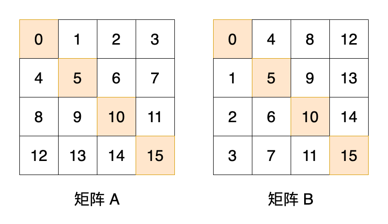
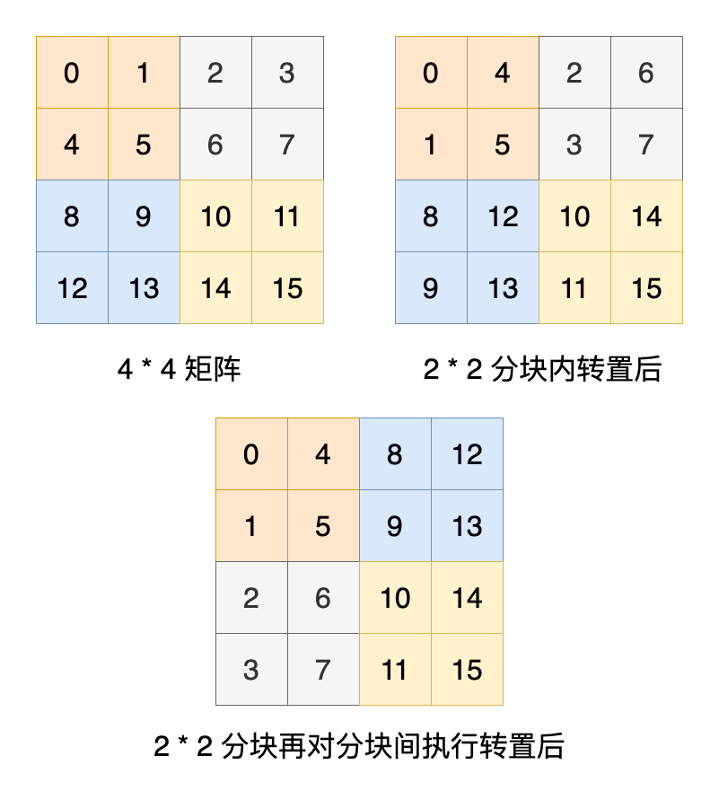

## 简介

Cache Lab 属于《深入理解计算机》第六章——存储器层次结构。这一章主要介绍了各种常见的存储器，并围绕着这局部性这个基本属性介绍了计算机的存储器系统的构成，最后详细讲解了高速缓存存储器的组织结构。 Cache Lab 分为两部分，第一部分就是让大家写一个高速缓存的模拟器，实现硬件中读写数据功能，并统计命中数等统计信息，从而让掌握这部分原理；第二部分就是针对三种矩阵写出能充分利用缓存的转置函数，使得不命中数最少，主要在于使用分块技术减少缓存多次加载。

## 知识点回顾

### 局部性 `P418`

一个编写良好的计算机程序常常具有良好的局部性。现代计算机系统的各个层次，从硬件到操作系统、再到应用程序，它们的设计都利用了局部性。所以只要我们的程序有良好的局部性，那么执行的速度将有质的提升。

局部性通常有两种不同的形式：
- 时间局部性：被引用过一次的内存位置很可能在不远的将来再被多次引用
- 空间局部性：一个内存位置被引用过一次，很可能在不远的将来引用其附近的一个内存位置

```c
int sumvec(int v[N]) {
    int i, sum = 0;
    for (i = 0; i < N; i++) {
        sum += v[i];
    }
}
```

上面这个简单的循环求和就具有良好的局部性： `sum` 和 `i` 具有良好的时间局部性，数组 `v` 具有良好的空间局部性。

### 空间局部性的重要性 `P447`

即使程序的时间局部性很差，但空间局部性仍然能补救，并且非常重要。 `P445`

下面这个例子告诉我么空间局部性的重要性，并让我们将注意力集中在内循环上。

考虑一对 `n * n` 矩阵相乘的问题： C = AB 。有以下 6 个版本的计算方法（假设为整型或者浮点数加法可结合）：

```c
// a) ijk 版本
for (i = 0; i < n; i++) {
    for (j = 0; j < n; j++) {
        sum = 0;
        for (k = 0; k < n; k++) {
            sum += A[i][k] * B[k][j];
        }
        C[i][j] += sum;
    }
}

// b) jik 版本
for (j = 0; j < n; j++) {
    for (i = 0; i < n; i++) {
        sum = 0;
        for (k = 0; k < n; k++) {
            sum += A[i][k] * B[k][j];
        }
        C[i][j] += sum;
    }
}

// c) jki 版本
for (j = 0; j < n; j++) {
    for (k = 0; k < n; k++) {
        r = B[k][j];
        for (i = 0; i < n; i++) {
            C[i][j] += A[i][k] * r;
        }
    }
}

// d) kji 版本
for (k = 0; k < n; k++) {
    for (j = 0; j < n; j++) {
        r = B[k][j];
        for (i = 0; i < n; i++) {
            C[i][j] += A[i][k] * r;
        }
    }
}

// e) kij 版本
for (k = 0; k < n; k++) {
    for (i = 0; i < n; i++) {
        r = A[i][k];
        for (j = 0; j < n; j++) {
            C[i][j] += r * B[k][j];
        }
    }
}

// f) ikj 版本
for (i = 0; i < n; i++) {
    for (k = 0; k < n; k++) {
        r = A[i][k];
        for (j = 0; j < n; j++) {
            C[i][j] += r * B[k][j];
        }
    }
}
```


上图显示了前面 6 个版本的性能，可以发现它们成对分成了三条折线：对于大的 n 值，最慢的版本比最快的版本慢了近 40 倍，这足以说明空间局部性的重要性了。

我们在列出这 6 个版本每次迭代的加载存储次数和不命中次数：

| 矩阵乘法版本 (类) | 加载次数 | 存储次数 | A 未命中次数 | B 未命中次数 | C 未命中次数 | 总未命中次数 |
| --- |  --- |  --- |  --- |  --- |  --- |  --- |
| ijk & jik (AB) | 2 | 0 | 0.25 | 1.00 | 0.00 | 1.25 |
| jki & kji (AC) | 2 | 1 | 1.00 | 0.00 | 1.00 | 2.00 |
| kij & ikj (BC) | 2 | 1 | 0.00 | 0.25 | 0.25 | 0.50 |

这 6 个版本成对地形成了 3 个等价类，用内循环中访问的矩阵对来表示每个类，并分析内循环中 ABC 每次迭代的不命中次数：
- 类 AB: a, b 两个版本最内层引用的是矩阵 AB ，这也是我们最常见的写法
    - 以步长为 1 扫描 A 一行，每个高速缓存块会保存四个 8 字节的字，所以平摊下来 A 的每次迭代不命中 0.25 次
    - 以步长为 n 扫描 B 一列，因为 n 很大，所以每次对 B 的访问都会不命中，即 B 每次迭代不命中 1 次
    - 未引用 C ，所以 C 的每次迭代不命中 0 次
- 类 AC: c, d 两个版本最内层引用的是矩阵 AC ，与类 AB 相比，交换了内循环降低了空间局部性
    - 以步长为 n 扫描 A 一列，因为 n 很大，所以每次对 A 的访问都会不命中，即 A 每次迭代不命中 1 次
    - 未引用 B ，所以 B 的每次迭代不命中 0 次
    - 以步长为 n 扫描 C 一列，因为 n 很大，所以每次对 C 的访问都会不命中，即 C 每次迭代不命中 1 次
- 类 BC: e, f 两个版本最内层引用的是矩阵 BC
    - 未引用 A ，所以 A 的每次迭代不命中 0 次
    - 以步长为 1 扫描 B 一行，每个高速缓存块会保存四个 8 字节的字，所以平摊下来 B 的每次迭代不命中 0.25 次
    - 以步长为 1 扫描 C 一行，每个高速缓存块会保存四个 8 字节的字，所以平摊下来 C 的每次迭代不命中 0.25 次

## 准备

可以在 [官网](http://csapp.cs.cmu.edu/3e/labs.html) 下载 Cache Lab 相关的程序。

开始前需要阅读 [Cache Lab writeup](http://csapp.cs.cmu.edu/3e/cachelab.pdf) ，可以知道本次 Lab 由 2 部分组成：第一部分让我们实现一个缓存模拟器（大概不到 300 行代码），第二部分让我们实现一个转置函数去充分利用缓存。

本次需要使用的程序依旧需要在 Docker 中运行，将本地 Lab 的目录挂载进容器中即可：

```shell script
docker run -ti -v {PWD}:/csapp ubuntu:18.04
```

进入容器后需要安装一些必须软件以便后续能成功运行：

```shell script
apt-get update && apt-get -y install gcc make valgrind
```

然后就可以愉快的开始闯关了。

## 闯关

### 第一部分

第一部分主要是写 LRU 内存模拟器，读入 `valgrind` 生成的内存访问记录，按顺序执行对应的内存操作：忽略以 `I` 开头的指令加载，只处理以 ` L`, ` S`, ` M` 开头的数据加载、数据存储和数据修改，按照书中 6.4.3 (`P433`) 中介绍的组相联高速缓存模拟这三个数据内存操作，并记录命中次数、未命中次数和驱逐次数。

注意：`L` 和 `S` 操作要么是一个命中，要么是一个未命中（有可能附带一个驱逐）；`M` 操作会被处理成先 `L` 再 `S` 操作，所以前者可能未命中（有可能附带一个驱逐），但后者必定命中。

由于组相联高速缓存很规整，第一维是长度 S 的缓存组，第二维是长度 E 的缓存行，所以我们可以使用一个二维数组模拟即可，元素的类型就是缓存行，仅存储标记等信息，不需要数据。

按照这个程序执行的流程可继续划分成三个部分：处理参数、初始化缓存、处理 trace 文件数据。

#### 处理参数

参数处理虽然不是我们的核心功能，但为了和原有程序保持一致，我们使用指南中提到的 `getopt` 库函数处理命令行入参数，这个库函数可以很方便处理各种必填/可选的选项。

```c
// 处理调用参数
void handle_args(int argc, char *argv[]) {
    // 接收 getopt 的返回值，表明当前处理的 flag
    int opt;

    // getopt 第三个参数表明所有选项，不可省略的选项字符后要跟冒号
    while(-1 != (opt = (getopt(argc, argv, "hvs:E:b:t:")))) {
        switch(opt) {
            case 'h':
                // usage 是我们定义的打印帮助函数的方法，就不展示了
                usage(argv[0]);
                break;
            case 'v':
                verbose = true;
                break;
            case 's':
                s = atoi(optarg);
                break;
            case 'E':
                E = atoi(optarg);
                break;
            case 'b':
                b = atoi(optarg);
                break;
            case 't':
                strcpy(tracefile_path, optarg);
                break;
            default:
                usage(argv[0]);
                break;
        }
    }
}
```

#### 初始化缓存

参数读取成功了，我们就需要初始化缓存及其相关数据了。

由于本 Lab 不需要存取数据，所以缓存行省略了缓存块，仅保留有效位、标记和上次访问时间，其中上次访问时间在执行 LRU 驱逐的时候使用。

初始化缓存时，我们需要先计算出组数 S 和缓存块大小 B 。然后给我们的缓存 `cache` 二维数组分配空间，先分配缓存组的空间，再分配每个缓存组的缓存行的空间，并同时设置每个缓存行未使用。

```c
typedef struct {
    // 有效位
    bool valid;
    // 标记
    int tag;
    // 上次访问时间
    int timestamp;
    // 由于本实验不需要存取数据，所以缓存块省略了
} CacheLine;

// 缓存的分布就类似一个二分数组
// 第一维用于定位在哪一组
// 第二维用于定位该组中的哪一行
CacheLine** cache;

// 初始化缓存
void init_cache() {
    int i, j;
    // 总共 2 ^ s 组
    S = 1 << s;
    // 每个缓存块供 2 ^ b 字节
    B = 1 << b;

    // 先分配 S 个缓存组的空间
    cache = (CacheLine**) malloc(sizeof(CacheLine*) * S);
    for (i = 0; i < S; i++) {
        // 再分配每个缓存组中的缓存行空间
        cache[i] = (CacheLine*) malloc(sizeof(CacheLine) * E);
        // 然后初始化每个缓存行的数据
        for (j = 0; j < E; j++) {
            cache[i][j].valid = false;
        }
    }
}
```

#### 处理 trace 文件数据

这一部分是我们缓存模拟器的核心代码，可以再细分为两个部分：读取 trace 文件每一行、对每一行执行对应的内存操作。

文件读取非常简单，就不赘述了，主要是三种内存操作。由于本 Lab 没有数据的使用，所以 Load 和 Store 操作可以合二为一，而 Modify 操作又可以拆分为先后执行 Load 和 Store 操作，最终我们可以使用一个 `load_or_store` 函数就可以统一这三种操作的情况。

`load_or_store` 函数的核心逻辑：
1. 通过地址获取缓存组下标和标记，然后遍历这个缓存组中的缓存行
2. 当发现缓存行有效且标记等于目标地址的标记，就说明命中缓存，记录统计数据后直接返回
3. 同时遍历的过程中还需要记录最后一个无效的缓存行，以及最早访问的有效的缓存行，用于未命中时的处理
4. 遍历完成后即表明未命中缓存，记录统计输出，然后判断是否需要驱逐
5. 将该地址的数据放入 3 中记录的缓存行中

```c
// 由于没有数据块，所以我们可以把 L 和 S 统一处理
// 0: 命中
// 1: 未命中未驱逐
// 2: 未命中已驱逐
int load_or_store(int address) {
    int j, info = 0;
    // 获取该地址对应的组下标
    int set_index = (address >> b) & (S - 1);
    // 获取该地址对应的行 tag
    int line_tag = address >> (s + b);
    // 假设可能失败且该组已满，这样我们可以一次循环处理出来结果
    int line_index = -1;
    // 同时假设可能失败且该组未满，这样我们可以一次循环处理出来结果
    int invalid_line = -1;
    for (j = 0; j < E; j++) {
        if (!cache[set_index][j].valid) {
            // 如果最后发现未命中缓存，那么该缓存行将存储这个数据
            invalid_line = j;
            continue;
        }

        // 如果是我们要找的地址，那么 命中 + 1 ，更新访问时间
        if (cache[set_index][j].tag == line_tag) {
            hits++;
            cache[set_index][j].timestamp = timestamp;
            return 0;
        }
        // 如果不是我们要找的地址，那么找到最早访问的行
        if (line_index == -1 || cache[set_index][line_index].timestamp > cache[set_index][j].timestamp) {
            line_index = j;
        }
    }

    // 此时没有命中
    misses++;
    info++;
    if (invalid_line == -1) {
        // 如果没有可用的行，则需要驱逐
        evictions++;
        info++;
        invalid_line = line_index;
    }
    // 将缓存放入该行，并更新对应的信息
    cache[set_index][invalid_line].valid = true;
    cache[set_index][invalid_line].tag = line_tag;
    cache[set_index][invalid_line].timestamp = timestamp;
    return info;
}
```

写完了我们就可以进行测试了：

```shell script
# 运行全部测试用例，可以发现能拿到全部 27 分
>  ./test-csim
                        Your simulator     Reference simulator
Points (s,E,b)    Hits  Misses  Evicts    Hits  Misses  Evicts
     3 (1,1,1)       9       8       6       9       8       6  traces/yi2.trace
     3 (4,2,4)       4       5       2       4       5       2  traces/yi.trace
     3 (2,1,4)       2       3       1       2       3       1  traces/dave.trace
     3 (2,1,3)     167      71      67     167      71      67  traces/trans.trace
     3 (2,2,3)     201      37      29     201      37      29  traces/trans.trace
     3 (2,4,3)     212      26      10     212      26      10  traces/trans.trace
     3 (5,1,5)     231       7       0     231       7       0  traces/trans.trace
     6 (5,1,5)  265189   21775   21743  265189   21775   21743  traces/long.trace
    27

TEST_CSIM_RESULTS=27
```

### 第二部分

第二部分要求我们对三种不同大小的矩阵写对应的转置函数，使得最终的缓存未命中次数 `m` 最小。

- `32 × 32`: 
    - m < 300: 满分
    - m > 600: 零分
- `64 × 64`: 8 points if m < 1, 300, 0 points if m > 2, 000
    - m < 1300: 满分
    - m > 2000: 零分
- `61 × 67`: 10 points if m < 2, 000, 0 points if m > 3, 000
    - m < 2000: 满分
    - m > 3000: 零分

本部分的一些限制条件如下：

- 最多使用 12 个 `int` 变量
- 不能使用未运算将多个值放到一个变量中
- 不能使用递归进行转置
- 不能修改 A ，可以随意修改 B
- 不能定义新的数组或分配内存
- 缓存参数： s = 5, E = 1, b = 5

**注意**：本部分使用 `./test-trans` 命令时需要确保程序在 Linux 机器内的文件夹下，而非我们挂载的目录中，否则会出现跑不出结果的问题。

#### 转置 `32 × 32` 矩阵

自带的简单转置函数很直观，没有其他知识也想不出更好的方法了。先跑一下这个结果，发现未命中次数为 `1183` 次，离目标 `300` 次以下还有很远，这时和做 [Architecture Lab](archlab.md) 最后一部分一样有点不知所措，不过指南最后提到了使用分块的方法可以优化，就继续学习 [分块技术](http://csapp.cs.cmu.edu/public/waside/waside-blocking.pdf) 。

分块技术的核心就是将矩阵划分成更小的块进行处理，使得每次处理的数据都能放入缓存中，并降低缓存在下次被使用前就被驱逐的概率。

题目限制我们使用的缓存行的缓存块大小为 `2 ^ 5 = 32` 个字节，可以存下 8 个整型，所以我们可以将分块大小定为 8 。这时不冲突的情况下需要使用 16 个缓存组，我们有 32 个缓存组，可以全部存下。这种情况下按照分块文档中提到的估计理论未命中次数是 `4 * 4 * 16 = 256` （总共有 `4 * 4` 个块，由于缓存组足够，那么不会产生驱逐，所以每个块中 A 和 B 各有 8 次无法避免的未命中）

```c
void trans_32_32(int M, int N, int A[N][M], int B[M][N]) {
    int i, j, k, l;
    for (i = 0; i < N; i += 8) {
        for (j = 0; j < M; j += 8) {
            for (k = i; k < (i + 8); k++) {
                for (l = j; l < (j + 8); l++) {
                    B[l][k] = A[k][l];
                }
            }
        }
    }
}
```

运行后发现未命中次数是 `343` ，距离理论居然差这么多。我们只能继续分析哪里贡献了多余的未命中次数。

查看 trace 文件后，我们发现 A 的起始地址是 `0x30a0c0` ， B 的起始地址是 `0x34a0c0` ，计算后发现 A 和 B 对应下标的地址会被映射到同一个缓存组（感到被针对），那么在进行转置的过程中，赋值 `B[0][0]` 时就会驱逐 `A[0][0]` 刚刚缓存的数据 ，导致 A 中还未使用的缓存数据白白浪费。这与我们开始设想的不会冲突有出入，所以我们必须处理这种冲突情况。

可以发现在处理 `B[l][k] = A[k][l]` 时，只有当 `k == l` 时才会出现刚刚所说的冲突，所以我们只要避免这种情况就行，我们可以提前将 A 中的 8 个整型一次性读入到临时变量中，保证内循环每次迭代时 A 只有一次未命中。

```c
void trans_32_32(int M, int N, int A[N][M], int B[M][N]) {
    int i, j, k;
    int v0, v1, v2, v3, v4, v5, v6, v7;
    for (i = 0; i < N; i += 8) {
        for (j = 0; j < M; j += 8) {
            for (k = i; k < (i + 8); k++) {
                v0 = A[k][j];
                v1 = A[k][j + 1];
                v2 = A[k][j + 2];
                v3 = A[k][j + 3];
                v4 = A[k][j + 4];
                v5 = A[k][j + 5];
                v6 = A[k][j + 6];
                v7 = A[k][j + 7];
                B[j][k] = v0;
                B[j + 1][k] = v1;
                B[j + 2][k] = v2;
                B[j + 3][k] = v3;
                B[j + 4][k] = v4;
                B[j + 5][k] = v5;
                B[j + 6][k] = v6;
                B[j + 7][k] = v7;
            }
        }
    }
}
```

这次未命中次数降为 `287` ，已经可以取得满分，但是这个未命中次数距离理论上未命中次数 `4 * 4 * (8 + 8) = 256` 还有一定距离，还有优化的地方。

刚刚我们只解决了 A 的冲突，并没有解决 B 的冲突， B 的冲突同样也只会出现在 `k == l` 时。例如：当 A 访问第 1 行时， B 会缓存 1 ~ 8 行，而接下来 A 会访问第 2 行，导致 B 缓存的第 2 行被白白浪费。所以我们需要在 B 访问第 2 行之前就取出 A 中第 2 行的数据，可以发现这种情况 A 和 B 是相同的分块位置，可以直接先将 A 中分块的数据拷贝到 B 中，保证每行复制时 A 和 B 各只有一次未命中；然后 B 中分块的数据都会在缓存中，所以对 B 原地转置不会有未命中发生（当然如果在拷贝数据的时候进行转置，无意义的复制次数会减少，不过代码比较难懂，还需要画图思考才行）。



我们列出 A 和 B 每次处理的那 16 个分块，可以发现正如前面推测的一样，只有对角线上的分块重叠了，所以必定会有冲突。我们只需要按照前面的特殊处理 `k == l` 的情况即可。

```c
void trans_32_32(int M, int N, int A[N][M], int B[M][N]) {
    int i, j, k, l;
    int v0, v1, v2, v3, v4, v5, v6, v7;
    for (i = 0; i < N; i += 8) {
        for (j = 0; j < M; j += 8) {
            if (i == j) {
                // 如果 i == j ，那么 A 和 B 的块会在对角线重叠
                // 由于 A 和 B 对应位置映射到同一个缓存行，所以必定冲突
                // 为了解决这个冲突，我们先将 A 中的 64 个整型复制到 B 中
                // 保证每行复制时 A 和 B 各只有一次未命中
                for (k = i; k < (i + 8); k++) {
                    v0 = A[k][j];
                    v1 = A[k][j + 1];
                    v2 = A[k][j + 2];
                    v3 = A[k][j + 3];
                    v4 = A[k][j + 4];
                    v5 = A[k][j + 5];
                    v6 = A[k][j + 6];
                    v7 = A[k][j + 7];
                    B[k][j] = v0;
                    B[k][j + 1] = v1;
                    B[k][j + 2] = v2;
                    B[k][j + 3] = v3;
                    B[k][j + 4] = v4;
                    B[k][j + 5] = v5;
                    B[k][j + 6] = v6;
                    B[k][j + 7] = v7;
                }
                // 此时 B 中的 8 * 8 小块全部在缓存中，在 B 中实现原地转置
                for (k = i; k < (i + 8); k++) {
                    for (l = k + 1; l < (j + 8); l++) {
                        v0 = B[k][l];
                        B[k][l] = B[l][k];
                        B[l][k] = v0;
                    }
                }
            } else {
                // 其实都可以按照前面的方法，先拷贝到 B 的小块中，再原地转置
                // 但是会有无意义的赋值操作，所以分开复杂度更低
                for (k = i; k < (i + 8); k++) {
                    v0 = A[k][j];
                    v1 = A[k][j + 1];
                    v2 = A[k][j + 2];
                    v3 = A[k][j + 3];
                    v4 = A[k][j + 4];
                    v5 = A[k][j + 5];
                    v6 = A[k][j + 6];
                    v7 = A[k][j + 7];
                    B[j][k] = v0;
                    B[j + 1][k] = v1;
                    B[j + 2][k] = v2;
                    B[j + 3][k] = v3;
                    B[j + 4][k] = v4;
                    B[j + 5][k] = v5;
                    B[j + 6][k] = v6;
                    B[j + 7][k] = v7;
                }
            }
        }
    }
}
```

测试后得到：`hits:2242, misses:259, evictions:227` ，未命中比理论的 `256` 次多了 `3` 次，我们需要再次分析多了哪几次？

```
# 查看哪些地址有未命中
> ./csim-ref -v -s 5 -E 1 -b 5 -t trace.f0 | grep miss
S 38b0ac,1 miss 
L 38b0c0,8 miss
...
S 38b0ad,1 miss eviction
hits:2242 misses:259 evictions:227
```

查看未命中的地址，可以发现最开始 2 次和最后 1 次都不是我们矩阵中的地址，所以这三次未命中与我们没有关系，说明我们矩阵的转置时的未命中次数成功达到了理论值。

#### 转置 `64 × 64` 矩阵

刚刚的矩阵居然成功达到了理论值，所以满心欢喜地继续测试转置 `64 × 64` 矩阵，未命中次数居然有 4435 次，又是零分。

查看 trace 文件后，我们发现 A 的起始地址是 `0x30c0c0` ， B 的起始地址是 `0x34c0c0` ，地址差和前面一样，所以理论上应该不会有这么多命中次数。

那么问题肯定处在唯一变化了的矩阵大小上，现在矩阵大小变成了 64 * 64 ，那么矩阵一行数据要占据 `64 * 4 = 256` 字节；而我们缓存的组索引为 5 ，块偏移为 5 ，那么总共能存下连续的 `2 ^ 10 = 1024` 字节数据，即可以存下矩阵的前 4 行数据，从第 5 行开始就会开始发生冲突，即 `B[i][j]` 和 `B[i + 4][j]` 必定冲突。

这种冲突对于 A 来说没有影响，因为每次都是读取一行中的 8 个整型，不会发冲突；主要影响 B ，因为此时缓存无法完全存储 B 的分块，只能存储 B 分块的一半，按照我们前面的方法必定每次都会发生冲突。

此时我们可以直接将分块大小变为 4 * 4 就可以避免冲突，不过此时分块的缓存利用率降低了，因为每次能缓存 32 个字节，但只使用了 16 个字节。

将分块变成 4 * 4 之后，我们再次运行测试程序，发现未命中次数是 1843 ，在零分附近徘徊，意料之中，毕竟我们浪费了一半的缓存。

所以我们只要充分利用好缓存即可轻易获得满分，那么还需要使用 8 * 8 分块。还可以怎么进行 8 * 8 的分块呢？可以发现我们前面针对 `l == m` 时的处理方法是先将元素直接拷贝，然后原地转置，这种方法是通用的（只是会多执行赋值操作），而且转置在分块中具有传递的特性，所以我们可以使用这种方法充分利用缓存。



我们假装进行 8 * 8 的分块转置，实际操作时还要再细化为 4 * 4 小分块转置：

1. 先进行 8 * 8 分块的前四行拷贝以便充分利用缓存，且保证 B 分块的前四行都在缓存中
2. 再将 B 分块的前四行执行两次 4 * 4 的分块进行转置（当然前两步可以合成一步，减少无意义的赋值操作，但不便于理解，需要配合画图思考）
3. 将 A 分块中的左下角转置到 B 分块中的右上角，同时将刚刚 B 分块中右上角转置好的小分块复制到 B 分块的左下角（【注意】这一步既对 A 分块左下角内部进行了转置，也把 A 分块左下角放到 B 分块右上角）
    - 这一步比较复杂，因为既涉及分块的小分块内转置，又涉及分块的小分块间转置；这是为了充分利用缓存，因为这一步无法继续拆分成更小的步骤
4. 然后将 A 分块的右下角拷贝至 B 分块的右下角，此时 B 分块的右下角都在缓存中
5. 最后将 B 分块右下角转置即可（当然最后两步可以合成一步，减少无意义的赋值操作，但不便于理解，需要配合画图思考）

前面这五步只有第三步比较复杂，所以仅列出第三步的代码：

```c
/*
 * 将 A[i][j] 的 8 * 8 分块中的左下角转置到 B[j][i] 分块中的右上角
 * 同时将 B[j][i] 分块中的右上角转置好的小分块复制到 B[j][i] 分块中的左下角
 */
void trans_8_8_bottom_left(int i, int j, int M, int N, int A[N][M], int B[M][N]) {
    int k;
    int v0, v1, v2, v3, v4, v5, v6, v7;
    // 此时只要 i != j ，那么 A[i][j] 分块和 B[j][i] 分块使用的缓存不会冲突
    for (k = 0; k < 4; k++) {
        // i != j: 第一次产生 4 个未命中，后续三次在缓存中无未命中
        // i == j: 第一次产生 4 个未命中，后续三次由于冲突各产生 1 次未命中
        v0 = A[i + 4][j + k];
        v1 = A[i + 5][j + k];
        v2 = A[i + 6][j + k];
        v3 = A[i + 7][j + k];
        // i != j: 由于前面已经用过 B[j][i] 分块的右上角，所以此时在缓存中，无未命中
        // i == j: 由于冲突，每次循环会发生 1 个未命中
        v4 = B[j + k][i + 4];
        v5 = B[j + k][i + 5];
        v6 = B[j + k][i + 6];
        v7 = B[j + k][i + 7];
        B[j + k][i + 4] = v0;
        B[j + k][i + 5] = v1;
        B[j + k][i + 6] = v2;
        B[j + k][i + 7] = v3;
        // 这里 B[j][i] 分块的左下角第一次访问，每次循环只发生 1 个未命中
        B[j + 4 + k][i] = v4;
        B[j + 4 + k][i + 1] = v5;
        B[j + 4 + k][i + 2] = v6;
        B[j + 4 + k][i + 3] = v7;
    }
    // 综上：这个函数每调用一次，
    //      i != j: 产生 8 个未命中
    //      i == j: 产生 15 个未命中
}
```

代码写完了，先分析一下理论上的未命中次数：
- `i != j`: 总共 56 个分块，每个分块未命中次数为 16 ，A 和 B 各 8 次必须的未命中
- `i == j`: 总共 8 个分块，每个分块未命中次数为 28 

总未命中次数 = `56 * 16 + 8 * 28` = `1120` ，如果还需要优化的话，依旧是处理 `i == j` 这种情况。

测试后得到：`hits:13730 misses:1123 evictions:1091` ，未命中比理论的 `1120` 次多了 `3` 次，同样为无关的未命中次数。

**注**：转置 `64 × 64` 矩阵这部分最好使用画图帮助理解，我已经将每一步中的未命中次数详细注明在代码中，可以查看代码深入理解。

#### 转置 `61 × 67` 矩阵

由于矩阵大小变成了 `61 * 67` ，我们在前面遇到的分块内冲突的情况基本消失了，但是也产生了一个新的问题：由于矩阵列长不是 8 的倍数，所以即使分块了，也可能无法充分一个缓存行。这时我们枚举分块大小不断尝试，发现当分块为 17 * 17 时，未命中次数为 `1950` ，可以达到满分。前面和 `64 × 64` 矩阵纠缠了好久，也基本掌握了如何分析缓存使用并改进，现在觉得拿到满分就好，不用拿到最低分。

```c
void trans_61_67(int M, int N, int A[N][M], int B[M][N]) {
    int i, j, k, l;
    for (i = 0; i < N; i += 17) {
        for (j = 0; j < M; j += 17) {
            for (k = i; k < i + 17 && k < N; k++) {
                for (l = j; l < j + 17 && l < M; l++) {
                    B[l][k] = A[k][l];
                }
            }
        }
    }
}
```

## 小结

Cache Lab 两部分是递进的关系，第一部分通过实现一个高速缓存模拟器加深对缓存实现原理的理解；第二部分则通过转置三个不同大小的矩阵，在理解原理的基础上，使用分块技术去充分利用缓存，并为了获得满分去进行更详细的调试与分析，从而提升了编程能力和调试分析能力。

Cache Lab 和本章主要目的还是让我们知道缓存的重要性，仅仅是局部性这个基本属性就能从各方面去优化，从而极大地提升程序的性能。